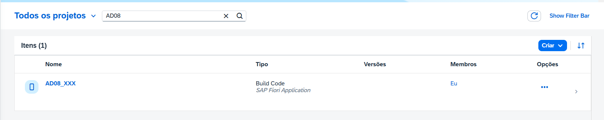

# Exercício 0 - Introdução

Neste exercício, você será orientado sobre como acessar sua conta do SAP Business Application Studio, configurar um espaço de desenvolvimento e obter uma rápida introdução às suas funcionalidades.

## Acessando o SAP Build Lobby

Ao final dessas etapas, você saberá como navegar do SAP Build Lobby para o SAP Business Application Studio e configurá-lo para suas necessidades de desenvolvimento.

1. Abra o [SAP Build Lobby](https://lcapteched.eu10.build.cloud.sap/lobby) usando um navegador da Web de sua preferência (Google Chrome, Microsoft Edge, Apple Safari, etc.) e faça login usando suas credenciais.

2. Clique no botão *Criar* acima da tabela para iniciar um novo projeto.

3. É hora de *Criar um aplicativo!* Clique no bloco correspondente.

4. Selecione *SAP Build Code*.

5. Escolha *SAP Fiori Application*.

6. Atribua um nome ao seu novo projeto, por exemplo, AD08_XX , onde XX é o seu número de usuário. Escolha o espaço de desenvolvimento que desejar e clique em "Criar".

7. Seu espaço de desenvolvimento agora está sendo configurado e lançado. Esse processo pode levar alguns instantes. Aguarde enquanto ele está sendo criado. Você pode encontrar seu novo projeto na tabela. Clicar em *AD08_XX* ou no nome do seu projeto o levará ao SAP Business Application Studio

## Summary

Parabéns! Você usou com sucesso o SAP Build Lobby para criar seu próprio projeto e se familiarizou com os conceitos básicos da plataforma. Mantenha o ritmo enquanto continua para o [Exercício 1 - Configuração do projeto usando o SAP Business Application Studio](../ex1/README.md).
