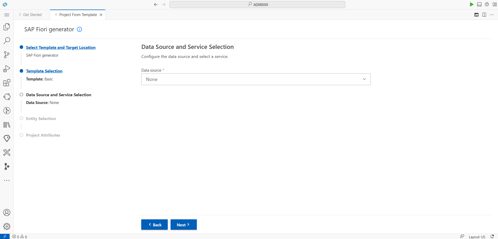
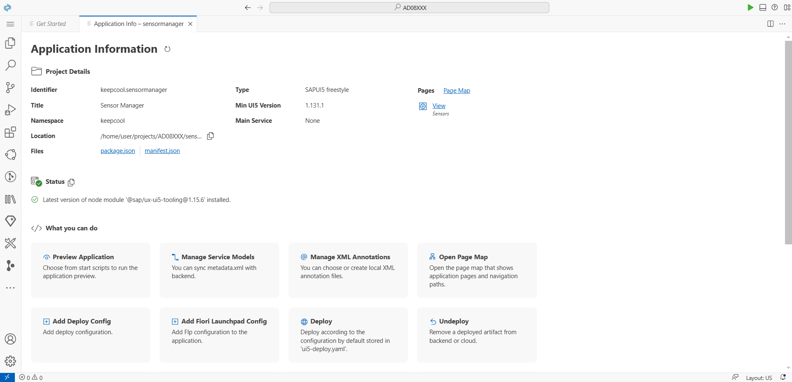

# Exercício 1 - Configuração do projeto usando o SAP Business Application Studio

Neste exercício, você criará um novo aplicativo UI5 com base em um modelo fornecido pelo SAP Business Application Studio.

## Cenário

Seu cliente "Keep Cool, Inc." é um operador de várias casas de gelo em todo o país. Recentemente, eles foram atualizados com novos sensores com conexão à Internet, para que seus valores de medição estejam disponíveis como um serviço. Para fazer uso desses dados e melhorar seus fluxos de trabalho internos, a empresa nos pediu para fornecer um aplicativo aproveitando esses dados do sensor, visualizá-los e fornecer uma visão geral do estado atual de cada sensor, para que eles possam reagir rapidamente a quaisquer problemas.

## Exercício 1.1 – Criar um novo aplicativo UI5

Depois de concluir essas etapas, você terá criado seu primeiro aplicativo UI5.

1. Clique em *New Project from Template* na págna *Get Started*.
    * [Opcional] Se você fechou a página *Get Started* , clique no botão superior (três linhas horizontais, também conhecidas como 'ícone de hambúrguer') na barra de navegação à esquerda e selecione *Help* e, em seguida, selecione *Get Started* para reabrir a página.</ul>

   

2. Clique no *SAP Fiori generator* como modelo e clique em *Start*.

   

3. Na etapa *Template Selection*, selecione *Basic* como modelo de aplicativo e clique em *Next*.

   

4. Selecione *None* como Data Source, pois você desenvolve sem uma fonte de dados externa. Clique em *Next*

   

5. Insira *Sensors* como view name. (Mesmo que esta etapa seja intitulada "Entity Selection", você não seleciona um conjunto de entidades, pois começa sem um serviço de dados).
   
   

7. Insira as seguintes configurações na etapa *Project Attributes*:
    1. Insira *sensormanager* como *Module name*.
    2. Insira *Sensor Manager* como *Application title*.
    3. Insira *keepcool* como *Application namespace*.
    4. Você pode manter a descrição padrão.
    5. Mantenha o caminho da pasta do projeto como */home/user/projects/AD08_XXX*
    6. Mantenha a versão mais recente disponível da UI5 selecionada.
    7. Defina *Add deployment configuration* como *Yes*.
    8. Defina *Configure advanced options* como *Yes*. Novas opções aparecem abaixo.
    9. Na parte inferior, defina *Enable TypeScript* como *Yes* para implementar o aplicativo usando TypeScript.
    10. Clique em *Next*.
   
   

8. Na próxima etapa, selecione *Cloud Foundry* como destino, deixe o nome do Destino como "None" e certifique-se de que a opção *Yes* esteja marcada para adicionar o aplicativo ao roteador do aplicativo e clique em *Finish*.  </ul>

    

8. O projeto agora está sendo gerado e uma janela de notificação aparecerá no canto inferior direito assim que o processo for concluído.

9. Depois que o processo for concluído, o Storyboard será aberto, o que será útil para projetos maiores com fontes de dados externas. Não fazemos uso dele neste tutorial. Em vez disso, você pode abrir a página *Application Info* para obter uma visão geral do projeto e a lista de coisas que você pode fazer com o projeto. Para fazer isso, abra a Paleta de Comandos usando o comando `CTRL + Shift + P` (`Cmd + Shift + P` no Mac), filtre por "*Fiori: Open Application Info*" e selecione-o.

## Exercício 1.2 – Experimentar o aplicativo gerado

É hora de uma primeira prévia do seu aplicativo recém-criado!

1. Para iniciar o aplicativo, pressione o ícone verde de *play* ("Run and Debug") no lado direito da barra de cabeçalho.

2. No menu suspenso que se abre no cabeçalho, selecione a primeira entrada "Start sensormanager" (*sem* "Local"). Para inícios subsequentes, esta seleção será lembrada.)

3. Após alguns instantes, o aplicativo deve ser iniciado:

## Resumo
Muito bem! Você criou e visualizou com êxito uma nova aplicação UI5 usando o SAP Business Application Studio.

Agora você está pronto para aproveitar os dados do sensor para "Keep Cool, Inc.". Esta etapa fundamental coloca você no caminho certo para melhorar seu fluxo de trabalho e reagir rapidamente a quaisquer problemas de sensor. Continue o bom trabalho enquanto avança para o [Exercício 2 - Adicionar primeiro conteúdo](../ex2/README.md).
