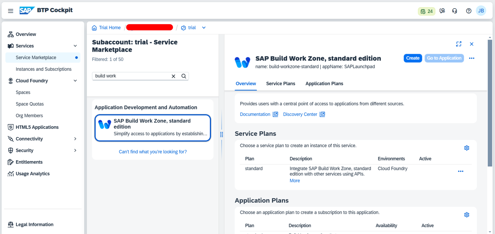
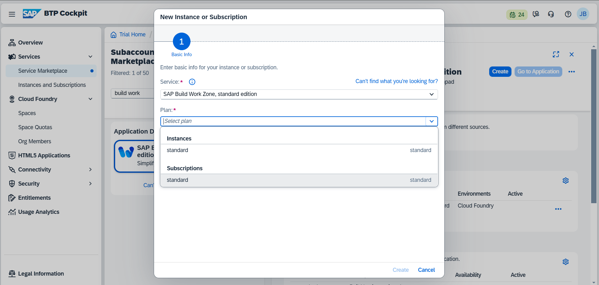
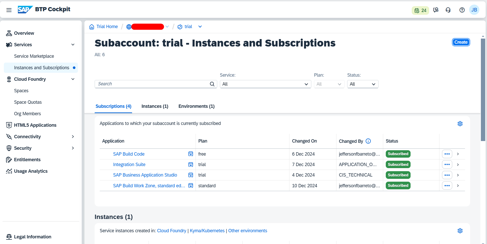
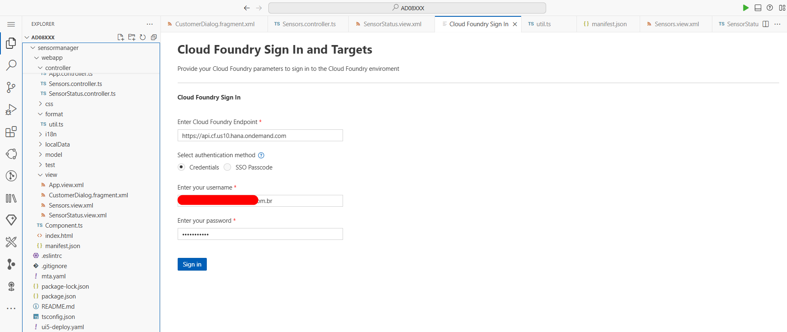

# Exercício 10 - Implante seu aplicativo no SAP BTP, tempo de execução do Cloud Foundry

Neste exercício, você aprenderá como é fácil implantar seu aplicativo diretamente do SAP Business Application Studio no SAP BTP, tempo de execução do Cloud Foundry.

## Exercício 10.1 - Crie Space no Cloud Foundry

Primeiro, você precisa criar o Space em seu ambiente do Cloud Foundry para hospedar seu aplicativo UI5 recém-criado.

1. Abra o SAP BTP Trial abrindo *https://cockpit.hanatrial.ondemand.com/cockpit/#/home/trial* em uma nova guia do navegador e clique em *Go To Your Trial Account*.

2. Você será redirecionado para seu SAP BTP Cockpit pessoal, onde suas subaccounts estão listadas. Clique na subaccount *trial*.

3. Abra *Spaces* abaixo do item de menu *Cloud Foundry* (expanda *Cloud Foundry* se necessário). Até agora, nenhum espaço foi criado por você dentro deste tutorial (mas um espaço *dev* pode já existir). Clique em *Create Space*.

4. No pop-up, insira o nome do Space, por exemplo, *ui5-apps* e deixe a seleção de função como está. Clique em *Create*.

5. O Space recém-criado é exibido.

6. NÃO clique no nome do Space (isso entraria no Space, do qual não precisamos agora). Se você fez isso, clique na subconta "trial" acima da área de conteúdo para navegar para cima novamente.

## Exercício 10.2 - Assinar o SAP Build Work Zone Service

Para poder exibir aplicativos UI5 implantados, precisamos do serviço "SAP Build Work Zone, standard edition" (anteriormente conhecido como "Launchpad Service") em nossa conta de teste.

1. Para assinar, clique em *Service Marketplace* no lado esquerdo abaixo de *Services* e pesquise o serviço "SAP Build Work Zone, standard edition".

2. Clique no bloco de serviço "SAP Build Work Zone, standard edition" e depois em *Create* no lado direito.

3. Na lista suspensa vazia chamada "Plan", selecione "standard - Subscription" e clique em *Create*.

4. Close the "Creation in Progress" popup. If you now click on *Instance and Subscriptions* you'll see that you have subscribed to the Launchpad Service.

## Exercício 10.3 - Login no Cloud Foundry

Agora você pode fazer login no seu ambiente Cloud Foundry diretamente do SAP Business Application Studio.

1. Abra o SAP Business Application Studio. Clique no botão mais alto na barra lateral esquerda (três linhas horizontais), depois em *Exibir* e selecione *Paleta de comandos...*. (Alternativamente, pressione `CTRL + Shift + P` no Windows/Linux, `Cmd + Shift + P` no Mac.) Em seguida, comece a digitar *CF: Login to cloud foundry* até que você possa ver e clicar na respectiva entrada.
Agora especifique suas credenciais de usuário e faça login.

## Exercício 10.4 - Definir organização e espaço

Após efetuar login, você será solicitado a especificar a organização e o Space desejados do Cloud Foundry. Selecione o espaço *ui5-apps* que você criou acima e pressione "Aplicar":

## Exercício 10.5 - Crie seu aplicativo

Agora é hora de criar seu aplicativo. Sim!

1. Clique com o botão direito no arquivo `mta.yaml` na pasta raiz.

2. Selecione *Build MTA Project*. A criação é iniciada.

3. Quando a compilação for concluída, o terminal exibirá mensagens de que o arquivo MTA foi gerado e os arquivos temporários foram limpos:

## Exercício 10.6 - Implante seu aplicativo

A etapa de construção criou um arquivo chamado `keepcool-sensormanager_0.0.1.mtar` localizado em `mta_archives`. Este arquivo contém sua construção.

1. Clique com o botão direito do mouse em `sensormanager/mta_archives/keepcool-sensormanager_0.0.1.mtar` e selecione *Implantar arquivo MTA*. A implantação é iniciada.

2. A implantação leva algum tempo. Quando estiver concluída, você será notificado no terminal.

## Exercício 10.7 - Execute seu aplicativo no SAP BTP

1. O aplicativo implantado pode ser iniciado a partir do SAP BTP Cockpit. Vá para sua trial subaccount e clique na seção *HTML5 Applications* no lado esquerdo. O aplicativo está listado lá como 'keepcoolsensormanager'. Clique nele para iniciá-lo.

> OBSERVAÇÃO: o aplicativo NÃO está listado entre *Applications* no espaço "ui5-apps", mas entre *HTML5 Applications* na subconta "trial" que o contém!

2. Parabéns! Você implantou seu aplicativo UI5 no SAP BTP, Cloud Foundry runtime.

## Resumo
Ótimo trabalho! Você aprendeu a implementar seu aplicativo UI5 do SAP Business Application Studio para o SAP BTP, tempo de execução do Cloud Foundry. Desde a criação de um espaço no Cloud Foundry, assinatura do SAP Build Work Zone Service, login no Cloud Foundry, configuração da sua organização e espaço, configuração do seu aplicativo, criação e, finalmente, implementação do seu aplicativo - você fez tudo!

Continue com o bom trabalho e continue curioso sobre o SAPUI5, pois ainda há muito a aprender! Encontre mais informações e tutoriais sobre o SAPUI5 e o BTP abaixo.

## Mais informações

* UI5 Tutorials: https://sapui5.hana.ondemand.com/#/topic/8b49fc198bf04b2d9800fc37fecbb218
* SAP Tutorials: https://developers.sap.com/tutorial-navigator.html
