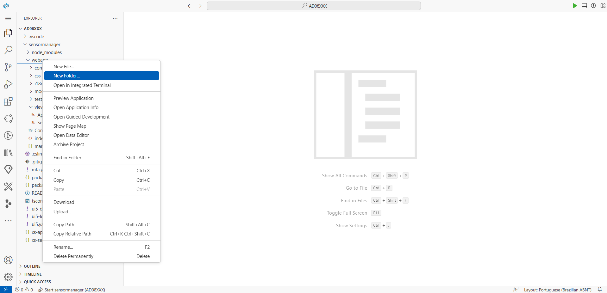
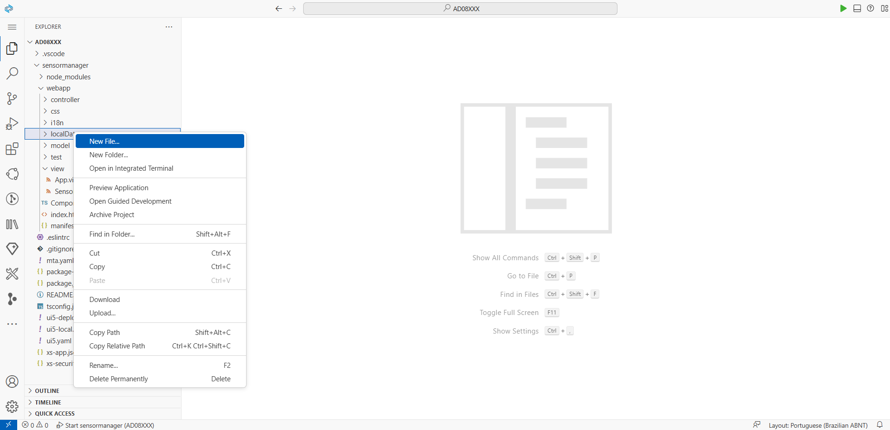
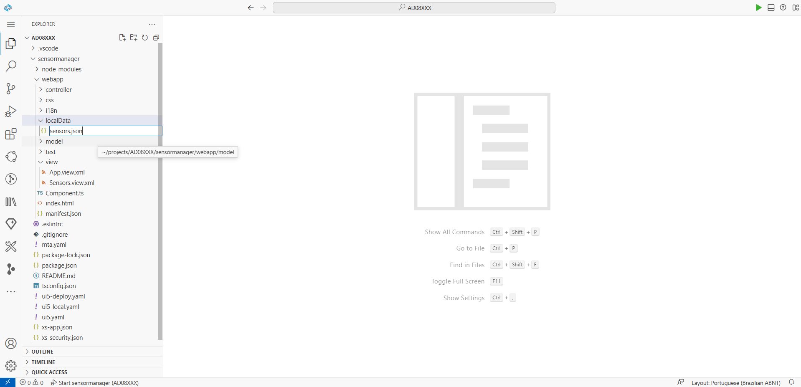
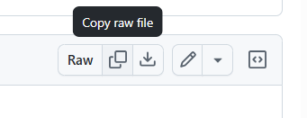
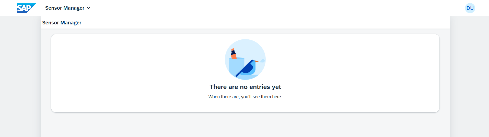
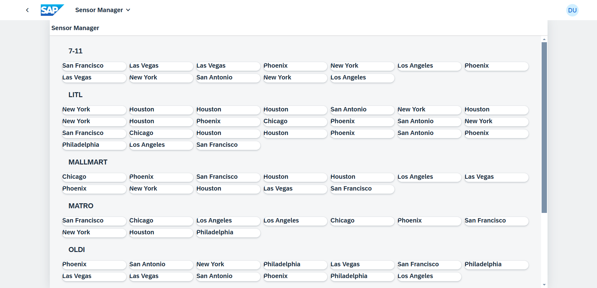

[](https://github.com/SAP-samples/teched2023-AD265/tree/code/exercises/ex3)
[](https://sap-samples.github.io/teched2023-AD283v/ex3/test/flpSandbox-cdn.html?sap-ui-xx-viewCache=false#keepcoolsensormanager-display)
# Exercício 3 - Mostrar conteúdo do sensor

Neste exercício, você adicionará uma fonte de dados local ao aplicativo e exibirá os dados na visualização aprimorada da UI5.

## Exercício 3.1 - Importar dados do sensor

Para simular um servidor fornecendo dados do sensor, você agora adicionará alguns dados do sensor local ao seu aplicativo.

1. Clique com o botão direito do mouse na pasta `sensormanager/webapp/` e selecione *New Folder*.



2. Insira *localData* como o nome da pasta e confirme pressionando *Enter*.

3. Clique com o botão direito na pasta `localData` e selecione `New File`.



4. Digite `sensors.json` como nome do arquivo e confirme pressionando *Enter*.



5. Copie e cole o conteúdo de [sensors.json](data/sensors.json) no arquivo recém-criado. Dica: quando você segue o link, há um botão "Copiar arquivo raw" (parece quadrados sobrepostos) no cabeçalho logo acima do conteúdo do arquivo.



## Exercício 3.2 - Configurar uma fonte de dados

Após adicionar os dados do sensor ao seu aplicativo, você precisará configurar a fonte de dados que fornece os dados do sensor.

1. Clique no link `manifest.json` na página *Informações do aplicativo*. Se você fechou a página *Informações do aplicativo*, você pode reabri-la usando o comando `Fiori: Abrir informações do aplicativo` na paleta de comandos. Você também pode encontrar o arquivo `manifest.json` localizado em `sensormanager/webapp`.

2. Vá para a seção `sap.app`. Aqui, no final da lista, após "sourceTemplate", adicione a seção `dataSources` da seguinte forma:
   
###### sensormanager/webapp/manifest.json

```js
    "sap.app": {
        ... ,
        "dataSources": {
            "sensorSource": {
                "type": "JSON",
                "uri": "./localData/sensors.json"
            }
        }
    }
```

>💡 Novamente, não se esqueça de adicionar a vírgula após o bloco anterior "sourceTemplate".

> 🧑‍🎓 O `sensorSource`, aponta para o arquivo de dados do sensor que você acabou de adicionar à pasta `localData`. Em aplicações da vida real, você frequentemente configura um URI de um serviço real aqui e seu tipo ("OData") e versão do protocolo.

3. Vá para a seção `sap.ui5`. (Não `sap.ui`!) Aqui, adicione uma seção "sensorModel" como segue:
   
###### sensormanager/webapp/manifest.json

```js
"sap.ui5": {
  ...
  "models": {
      "i18n": {
          "type": "sap.ui.model.resource.ResourceModel",
          "settings": {
              "bundleName": "keepcool.sensormanager.i18n.i18n"
          }
      },
      "sensorModel": {
          "type": "sap.ui.model.json.JSONModel",
          "dataSource": "sensorSource"
      }
  },
```

> 🧑‍🎓 Isso adiciona o `JSONModel` com o nome `sensorModel`, que fornecerá acesso aos dados no aplicativo e se refere à fonte de dados que foi criada acima.

4. Como este workshop não usa serviços de flexibilidade, desabilite-os alterando a primeira entrada na seção `sap.ui5` da seguinte forma:

```js
    "sap.ui5": {
      "flexEnabled": false,
    ...
```

## Exercício 3.3 - Adicionar uma GridList

Após configurar o serviço de dados, agora é hora de enriquecer seu `Sensors.view.xml` com alguns controles UI5 sofisticados!

1. Abra o `Sensors.view.xml` localizado em `sensormanager/webapp/view`.

2. Adicione `sap.f` e `sap.ui.layout.cssgrid` às declarações de namespace xml para garantir que os recursos necessários estejam disponíveis em sua visualização. Reorganize o conteúdo um pouco para uma melhor visão geral, para que fique assim:
   
###### sensormanager/webapp/view/Sensors.view.xml

```xml
<mvc:View
    controllerName="keepcool.sensormanager.controller.Sensors"
    xmlns:mvc="sap.ui.core.mvc"
    xmlns="sap.m"
    xmlns:f="sap.f"
    xmlns:grid="sap.ui.layout.cssgrid"
    displayBlock="true">
```

3. Adicione `sap.f.GridList` à agregação `content` do IconTabBar (entre `<content>` e `</content>`).

###### sensormanager/webapp/view/Sensors.view.xml

```xml
                    <f:GridList id="sensorsList">
                        <f:items>
                            <!-- item template will be added here! -->
                        </f:items>
                        <f:noData>
                            <IllustratedMessage enableVerticalResponsiveness="true" illustrationType="sapIllus-EmptyList"/>
                        </f:noData>
                    </f:GridList>
```

> 🧑‍🎓 Como visto antes, uma *agregação* é o relacionamento pai-filho dentro da estrutura de árvore dos elementos da IU. A extremidade filho da relação pode ter cardinalidade 0..1 ou 0..*. A API dos elementos oferece métodos convenientes e consistentes para lidar com agregações (por exemplo, para obter, definir ou remover elementos filhos). Exemplos são linhas e células de tabela ou o conteúdo de uma célula de tabela.
> O conteúdo da agregação `noData` - uma mensagem ilustrada - é exibido quando nenhum dado está disponível para ser exibido em itens.

4. Mude para a guia do navegador com a visualização e veja o aplicativo UI5 atualizado (atualize/reinicie se necessário).



## Exercício 3.4 - Adicionar Data Binding

Após adicionar o controle `sap.f.GridList`, você precisará conectar o controle aos dados do sensor. Para isso, a UI5 fornece um mecanismo chamado *Data Binding*.

1. Caso você tenha fechado, abra o `Sensors.view.xml` localizado em `sensormanager/webapp/view`.

2. Vincule a agregação `items` do `sap.f.GridList` ao caminho `sensorModel>/sensors`. Aqui, `sensorModel` é o nome do seu modelo de dados definido recentemente, e `/sensors` aponta para uma propriedade dentro dele. Como essa propriedade contém uma matriz com várias entradas, você provavelmente gostaria de definir classificação e agrupamento também. No `sorter`, você pode configurar isso usando as propriedades disponíveis. Para fazer tudo isso, altere a tag de abertura `<f:GridList ...>` da seguinte forma:

###### sensormanager/webapp/view/Sensors.view.xml

```xml
                    <f:GridList
                        id="sensorsList"
                        items="{path: 'sensorModel>/sensors', sorter: {path:'customer', group:true, descending: false}}"
                        noDataText="No sensors">
```

3. Os itens da lista são definidos *uma vez* como um modelo, que é então repetido automaticamente várias vezes pela vinculação de dados UI5 para representar cada entrada do array de sensores. Cada item da lista receberá automaticamente os dados de uma entrada do array do arquivo json. Também adicionamos alguns detalhes de localização ao nosso `sap.f.GridListItem`. Aqui, `location` faz referência à propriedade de localização de cada um dos itens do sensor exibidos. Substitua o comentário `<!-- item template will be added here!>` pelo seguinte modelo de item:

###### sensormanager/webapp/view/Sensors.view.xml

```xml
                            <f:GridListItem>
                                <Title text="{sensorModel>location}"/>
                            </f:GridListItem>
```

4. Vamos ver se nosso aplicativo UI5 exibe os dados corretos do sensor. Mude para a aba do navegador com a pré-visualização do aplicativo aberta (recarregue a página ou reinicie o aplicativo, se necessário).



## Resumo
Ótimo trabalho! Você adicionou com sucesso dados locais ao seu aplicativo, importou os dados do sensor, configurou uma fonte de dados e exibiu os dados usando controles UI5. Isso mostrou como a vinculação de dados do UI5 pode ser usada para preencher a interface do usuário. Seu aplicativo agora tem uma interface mais rica e está pronto para mostrar dados do sensor. Continue com o ótimo trabalho ao passar para [Exercício 4 - Introdução à localização](../ex4/README.md).

## Mais informações

* Data Binding: https://ui5.sap.com/#/topic/68b9644a253741e8a4b9e4279a35c247
