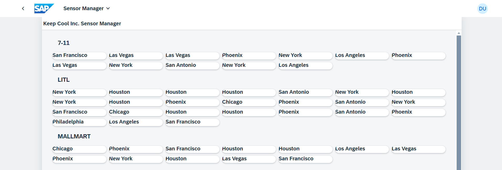
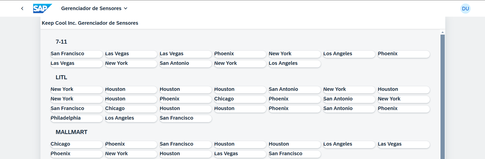

# Exercício 4 - Introduzir localização (i18n)

Neste exercício, você aprenderá como é fácil habilitar a localização para seu aplicativo UI5.

## Exercício 4.1 - Usando variáveis ​​i18n

O SAPUI5 tem a opção de suportar diferentes idiomas, configuráveis ​​com base nas preferências do usuário. Seus recursos prontos para empresas incluem recursos abrangentes de localização, como formatação de números e datas, suporte para idiomas da direita para a esquerda e muito mais, permitindo que os desenvolvedores adaptem facilmente seus aplicativos a vários idiomas e regiões, garantindo assim acessibilidade global e facilidade de uso. Neste exercício, focaremos na tradução.

Encontre o arquivo `i18n.properties`, que está localizado em `sensormanager/webapp/i18n/` e contém textos traduzíveis. Substitua o conteúdo pelo seguinte conjunto de variáveis:

###### sensormanager/webapp/i18n/i18n.properties

```ini
title=Keep Cool Inc. Sensor Manager
appTitle=Sensor Manager
appDescription=The sensor manager
noSensorDataText=No Sensor Data
msgSensorDataLoaded=All sensors online!
msgFilterAll=All
msgFilterCold=Cold
msgFilterWarm=Warm
msgFilterHot=Too Hot
toolTipShowCustomers=Show Customers
titleCustomerDialog=Customers
titleSensorStatus=Sensor Status
cardTitle=Customer
temperatureUnit=°C
```

>💡 Alguns dos textos serão usados ​​somente em exercícios futuros.

1. Alterne as abas do navegador (atualize se necessário) para ver como o título do seu aplicativo UI5 mudou.



## Exercício 4.2 - Adicionar idiomas adicionais

Seu aplicativo UI5 está preparado para localização. Mas agora, não importa qual idioma do navegador esteja configurado, seu aplicativo UI5 exibe atualmente os textos do arquivo `i18n.properties`.
Vamos fornecer novos arquivos de idioma para inglês e português.

1. Vá para a pasta `sensormanager/webapp/i18n/` e clique com o botão direito do mouse.

2. No pop-up, clique em `New File`.

3. Insira `i18n_en.properties` como nome do arquivo.

4. Repita as etapas 1 e 2.

5. Insira `i18n_pt.properties` como nome do arquivo.

6. Abra `i18n_en.properties` e cole o seguinte conteúdo:

###### sensormanager/webapp/i18n/i18n_en.properties

```ini
title=Keep Cool Inc. Sensor Manager
appTitle=Sensor Manager
appDescription=The sensor manager
noSensorDataText=No Sensor Data
msgSensorDataLoaded=All sensors online!
msgFilterAll=All
msgFilterCold=Cold
msgFilterWarm=Warm
msgFilterHot=Too Hot
toolTipShowCustomers=Show Customers
titleCustomerDialog=Customers
titleSensorStatus=Sensor Status
cardTitle=Customer
temperatureUnit=°C
```

>Por que inglês de novo? O arquivo original `i18n.properties` já era inglês! Normalmente, o idioma original é "inglês do desenvolvedor", servindo como entrada para traduções, incluindo revisão por um especialista em tradução para inglês para garantir uma boa linguagem. Em alguns casos, o idioma original pode nem ser inglês. Observe que alteramos a temperatura aqui para refletir Fahrenheit como medida comumente usada para temperaturas em alguns países de língua inglesa. Você pode escolher o que for melhor.

7. Abra `i18n_pt.properties` e cole o seguinte conteúdo:
   
###### sensormanager/webapp/i18n/i18n_pt.properties

```ini
title=Keep Cool Inc. Gerenciador de Sensores
appTitle=Gerenciador de Sensores
appDescription=O sensor
noSensorDataText=Nenhum dado do sensor
msgSensorDataLoaded=Todos os sensores online!
msgFilterAll=Todos
msgFilterCold=Frio
msgFilterWarm=Quente
msgFilterHot=Muito quente
toolTipShowCustomers=Mostrar clientes
titleCustomerDialog=Clientes
titleSensorStatus=Status do sensor
cardTitle=Cliente
temperatureUnit=°C
```

8. Dependendo do idioma do navegador que você configurou, agora você deve conseguir ver textos diferentes na sua interface de usuário.
* Se o idioma do seu navegador for inglês, o conteúdo de `i18n_en.properties` será usado.
* Se o idioma do seu navegador for português, o conteúdo de `i18n_pt.properties` será usado.
* Para qualquer outro idioma, o conteúdo de `i18n.properties` será usado.

## Exercício 4.3 - Configurar idiomas suportados

Normalmente, apenas o arquivo `i18n.properties` é mantido pelos desenvolvedores. Os arquivos dependentes de idioma serão preenchidos por falantes nativos ou tradutores. Como desenvolvedor de aplicativos, você pode configurar quais idiomas são suportados pelo seu aplicativo e qual idioma é seu idioma padrão (também conhecido como fallback). Nesta sessão, o inglês será o idioma padrão e, adicionalmente, o português deve ser suportado.

1. Clique no link `manifest.json` na página *Informações do aplicativo*. Se você fechou a página *Informações do aplicativo*, pode reabri-la usando o comando `Fiori: Abrir informações do aplicativo` na paleta de comandos. Você também pode encontrar o arquivo `manifest.json` localizado em `sensormanager/webapp`.

2. Vá para a seção `sap.ui5` / `models` / `i18n`. Aqui, adicione duas novas configurações dentro do seu objeto de configurações.
1. Adicione a propriedade `supportedLocales` e atribua os locais para Português e Inglês `["pt", "en"]`
2. Adicione a propriedade `fallbackLocale` e atribua o locale Inglês `"en"`

###### sensormanager/webapp/manifest.json

```json
            "i18n": {
                "type": "sap.ui.model.resource.ResourceModel",
                "settings": {
                    "bundleName": "keepcool.sensormanager.i18n.i18n",
                    "supportedLocales": ["pt", "en"],
                    "fallbackLocale": "en"
                }
            },
```

>🧑‍🎓 Este ResourceModel foi fornecido como parte do modelo do aplicativo e é um recurso do UI5 que fornece textos de UI automaticamente no idioma atual do usuário. A fonte de dados para o modelo são os arquivos `i18n...` que acabamos de criar, vinculados ao modelo pelo `bundleName`. Na visualização XML, os textos podem ser usados ​​como quaisquer outros dados de um modelo, usando vinculação de dados.

3. Vamos ver se seu aplicativo UI5 consegue iniciar em inglês e português! Mude para a aba do navegador com uma visualização do aplicativo aberta (recarregue a página se necessário). O aplicativo UI5 deve iniciar em inglês ou português, dependendo do idioma do seu navegador.


4. O UI5 suporta o parâmetro de URL `sap-ui-language=...` para simular outro idioma do navegador. O URL de visualização pode já ter outros parâmetros de URL mais um hash de URL e se parecer com isto:
`...cloud.sap/test/flpSandbox-cdn.html?sap-ui-xx-viewCache=false#keepcoolsensormanager-display`. É importante inserir o novo parâmetro de URL para o idioma na posição correta e separá-lo de outros parâmetros de URL com um caractere e comercial (`&`). A maneira mais fácil pode ser adicioná-lo logo atrás do ponto de interrogação, que separa o endereço dos parâmetros:
`...cloud.sap/test/flpSandbox.html?sap-ui-language=pt&sap-ui-xx-viewCache=false#keepcoolsensormanager-display`. Em seguida, pressione `Enter`. O UI5 agora deve iniciar em português, independentemente do idioma que você configurou como idioma do navegador.

> Se a URL terminar apenas com `....cloud.sap/index.html`, sem parâmetros de URL, você pode simplesmente acrescentar `?sap-ui-language=pt` para alternar para português.



5. Vamos tentar iniciar o aplicativo em outro idioma, por exemplo, alemão. Altere o parâmetro de URL acima para `sap-ui-language=de`. O UI5 agora deve iniciar em inglês, porque o alemão não é suportado e você configurou o inglês como seu local de fallback.


Se você quiser oferecer suporte ao alemão ou a qualquer outro idioma de sua escolha, sinta-se à vontade para repetir as etapas descritas em [Exercício 4.2 Adicionar novos idiomas](#exercise-42---add-additional-languages) com o idioma desejado.

## Resumo
Ótimo trabalho! Você implementou com sucesso a tradução em seu aplicativo UI5, permitindo que seu aplicativo suporte vários idiomas com base nas preferências do usuário. Ao longo do caminho, você aprendeu como o modelo de recursos funciona e o aplicativo pode ser alternado para diferentes idiomas. Este é um passo importante para tornar seu aplicativo globalmente acessível e amigável. Continue com o bom trabalho e continue para [Exercício 5 - Melhorar a visualização](../ex5/README.md)!

## Mais informações

* Localização: https://ui5.sap.com/#/topic/91f217c46f4d1014b6dd926db0e91070
* Localidades e fallback suportados: https://ui5.sap.com/#/topic/ec753bc539d748f689e3ac814e129563
