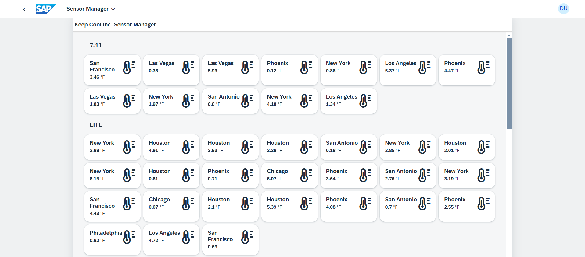
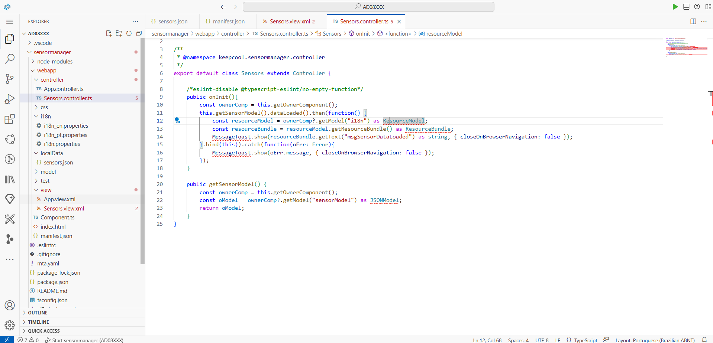
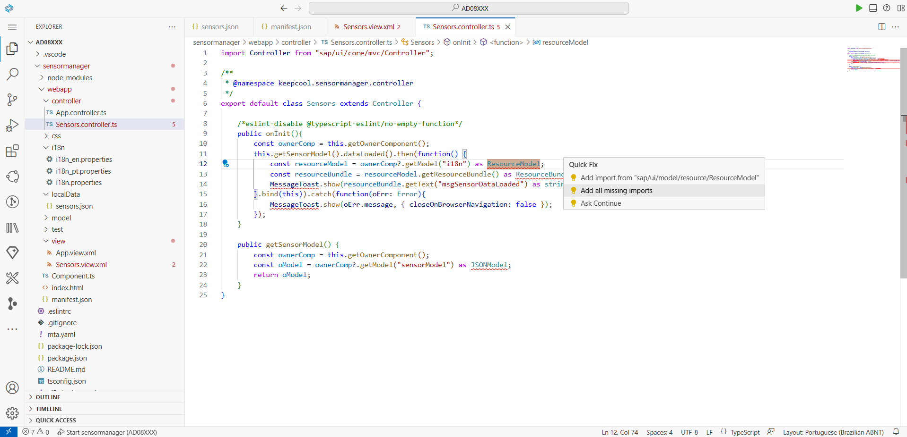
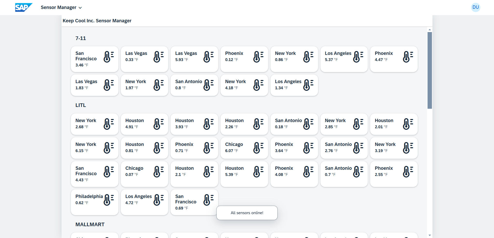
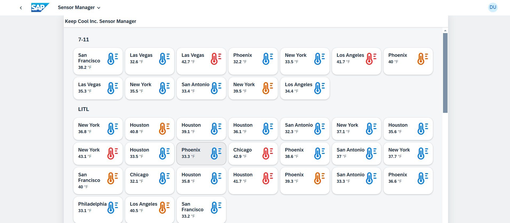

# Exercício 5 - Melhore a visualização

Você conseguiu muito nos exercícios anteriores. Agora é hora de enfeitar seu aplicativo UI5 com visuais melhores!

## Exercício 5.1 - Melhore Sensors.view.xml

Para dar ao cliente a melhor visão geral possível, adicione um pouco de cor ao seu aplicativo. Apresente um novo layout e estrutura para os itens e também mostre um `sap.ui.core.Icon` lá.

1. Abra `Sensors.view.xml` e adicione o namespace xml `xmlns:core="sap.ui.core"` à visualização para ter o `sap.ui.core.Icon` disponível.

###### sensormanager/webapp/view/Sensors.view.xml

```xml
<mvc:View
    controllerName="keepcool.sensormanager.controller.Sensors"
    xmlns:core="sap.ui.core"
    xmlns:mvc="sap.ui.core.mvc"
    xmlns="sap.m"
    xmlns:f="sap.f"
    xmlns:grid="sap.ui.layout.cssgrid"
    displayBlock="true">
```

2. Adicione um ícone de temperatura, bem como um título, um número e algum layout ao controle `sap.f.GridListItem` (não "GridList"!).

###### sensormanager/webapp/view/Sensors.view.xml

```xml
                            <f:GridListItem type="Active">
                                <HBox justifyContent="SpaceBetween"
                                    class="sapUiSmallMargin">
                                    <VBox>
                                        <Title
                                            text="{sensorModel>location}"
                                            wrapping="true"/>
                                        <ObjectNumber
                                            number="{sensorModel>temperature}"
                                            unit="{i18n>temperatureUnit}"/>
                                    </VBox>
                                    <core:Icon
                                        src="sap-icon://temperature"
                                        size="2.5rem"/>
                                </HBox>
                            </f:GridListItem>
```
> 🧑‍🎓 `sapUiSmallMargin` é novamente uma classe CSS predefinida, desta vez adicionando espaçamento *ao redor* dos controles. `sap.m.HBox` e `sap.m.VBox` são controles auxiliares para layout do seu aplicativo, organizando o conteúdo horizontal e verticalmente.

Vamos dar uma olhada no aplicativo e nas mudanças no layout do item do controle `GridList`:



> 💡 Observe que a temperatura ainda não está exibida corretamente, pois o formatador que faz a conversão de Celsius para Fahrenheit só será adicionado mais tarde neste exercício.

## Exercício 5.2 - Adicionar conteúdo a Sensors.controller.ts

Neste exercício, você aprimorará seu aplicativo com alguma codificação de controlador adicional.

> #### 🧑‍🎓 Explicação
> Este tutorial usa **TypeScript** em vez de JavaScript e este exercício é o primeiro em que você realmente escreve esse código, daí uma breve introdução:
>
> TypeScript não é muito diferente de JavaScript. Na verdade, é um superconjunto de JavaScript que apenas adiciona alguns recursos de linguagem *em cima* que são usados ​​para especificar os tipos de variáveis, parâmetros de função etc. e definir novos tipos como estruturas complexas. Como um exemplo simples, uma variável pode ser especificada para ter o tipo "string", então nunca um número pode ser atribuído (o que seria possível em JavaScript). O mesmo é possível para estruturas e classes mais complexas. Essas informações de tipo são usadas pelo editor de código para ajudar massivamente a escrever código: conclusão de código, documentação em linha, prevenção e detecção precoce de erros, melhor refatoração, manutenção mais fácil e muito mais. Usuários do UI5 que mudaram para TypeScript comumente confirmam que ele aumenta drasticamente a eficiência do desenvolvimento.
>
> Os navegadores não podem executar TypeScript, portanto, uma etapa de transpilação é necessária, que converte o código para JavaScript - basicamente removendo todas as informações de tipo. Isso também significa que a segurança de tipo e tudo o que o TypeScript fornece é puramente focado no tempo de desenvolvimento, não no tempo de execução do código. No entanto, o código-fonte original pode ser disponibilizado para navegadores usando "mapas de origem", então, ao depurar, você pode ver o código TypeScript original que escreveu.
>
> Mesmo o código JavaScript transpilado pareceria familiar, no entanto. Como você vê ao olhar os arquivos de origem do TypeScript no aplicativo, a maior parte do código é sintaxe JavaScript simples! Na maioria das vezes, adições específicas do TypeScript com informações de tipo estão apenas em alguns lugares.
>
> O próprio UI5 é escrito em JavaScript sem nenhuma informação de tipo. Mas todos os tipos das APIs do UI5 são declarados em arquivos de definição de tipo separados que são lançados pela equipe de desenvolvimento do UI5. Isso torna o editor e o transpilador cientes de quais tipos os parâmetros passados ​​para o UI5 devem ter e quais tipos os valores retornados têm. Essas definições de tipo já foram adicionadas como dependências neste modelo (a dependência dev `@sapui5/types` no arquivo `package.json`) e a etapa de transpilação também já está configurada e é quase transparente para você como desenvolvedor (manipulada pela tarefa de construção `ui5-tooling-transpile` e middleware para as ferramentas UI5).
>
> Com esse conhecimento, você agora está pronto para criar seu primeiro arquivo TypeScript!


1. Dê uma olhada em `sensormanager/webapp/controller/Sensors.controller.ts`

###### sensormanager/webapp/controller/Sensors.controller.ts

```js
import Controller from "sap/ui/core/mvc/Controller";

/**
 * @namespace keepcool.sensormanager.controller
 */
export default class Sensors extends Controller {

    /*eslint-disable @typescript-eslint/no-empty-function*/
    public onInit(): void {

    }
}
```
> #### 🧑‍🎓 Explicação
> Um controlador é o lugar onde você pode adicionar métodos que implementam a funcionalidade necessária na respectiva visualização. Ainda não há tal conteúdo, apenas `onInit`, que é um dos métodos de ciclo de vida chamados pelo framework UI5 - este é chamado quando o controlador é inicializado pela primeira vez. Mesmo este método está vazio, portanto, o comentário na linha acima foi adicionado no modelo para evitar mensagens de erro de linting (verificação de código). Este comentário pode ser excluído após adicionar o conteúdo do método.
>
> Caso você tenha visto o código de aplicativo UI5 tradicional antes ou não tenha ficado em contato com a evolução da linguagem JavaScript nos últimos anos, a sintaxe pode parecer estranha: é um módulo EcmaScript 6, a instrução `import` no topo está carregando uma classe UI5 ​​como dependência. A metade inferior é a definição de uma classe ES6 - sim, existem classes em JavaScript agora.
>
> Este código é quase 100% JavaScript puro sem sintaxe TypeScript (apenas o tipo de retorno `: void` é TypeScript e mesmo esta parte não é realmente necessária, pois o compilador TypeScript pode inferir o tipo de retorno). Como mencionado acima, a maior parte do código ainda será JavaScript válido. Adições específicas do TypeScript são necessárias apenas quando o compilador TypeScript não pode inferir automaticamente o tipo de algo. Mas aqui o tipo da classe `Controller` importada do UI5 é conhecido, graças às definições de tipo fornecidas pelo UI5, e o tipo da classe recém-definida é automaticamente compreendido pelo compilador TypeScript. Portanto, não há necessidade de adicionar nenhuma informação de tipo escrita para eles.
>
> Embora incentivemos o uso dessa sintaxe JavaScript moderna ao escrever TypeScript, em tempo de execução o UI5 ainda requer o uso de APIs específicas do UI5 para carregamento de módulo (`sap.ui.require(...)`/`sap.ui.define(...)`) e definição de classe (`SomeClass.extend("NewClassName", ...)`), portanto, além da transpilação do TypeScript, também as importações de módulo ES6 e classes são transformadas para essas APIs do UI5. O comentário `@namespace` acima da classe é necessário para criar o nome completo do pacote da classe.

2. Tente passar o mouse sobre `Controller` e você verá parte da documentação do UI5 para ele. Graças ao TypeScript, você pode até navegar até a definição da respectiva API do UI5. Por exemplo, no SAP Business Application Studio e no Microsoft Visual Studio Code, segurando a tecla `Ctrl`/`Cmd` enquanto clica no nome. Isso não leva ao código-fonte original do UI5, que é escrito em JavaScript, mas aos arquivos de definição de tipo TypeScript do UI5, que incluem toda a documentação. Pode ser muito útil navegar pelos métodos oferecidos por uma classe ou navegar mais acima na cadeia de herança.

3. Seu próximo objetivo é mostrar um `sap.m.MessageToast` quando seus dados de sensor forem carregados. Substitua a função `onInit` de `Sensors.controller.ts` e adicione uma função `getSensorModel` para recuperar o modelo de sensor (também remova o comentário `eslint-disable` acima de `onInit`):

###### sensormanager/webapp/controller/Sensors.controller.ts

```typescript
    public onInit() {
        const ownerComp = this.getOwnerComponent();
        this.getSensorModel().dataLoaded().then(function() {
            const resourceModel = ownerComp?.getModel("i18n") as ResourceModel;
            const resourceBundle = resourceModel.getResourceBundle() as ResourceBundle;
            MessageToast.show(resourceBundle.getText("msgSensorDataLoaded") as string, { closeOnBrowserNavigation: false });
        }.bind(this)).catch(function(oErr: Error){
            MessageToast.show(oErr.message, { closeOnBrowserNavigation: false });
        });
    }

    public getSensorModel() {
        const ownerComp = this.getOwnerComponent();
        const oModel = ownerComp?.getModel("sensorModel") as JSONModel;
        return oModel;
    }

```

> 🧑‍🎓 Este código *contém* alguma sintaxe adicional específica do TypeScript: instruções como `... as ResourceModel` e `... as string` são conversões de tipo que afirmam que o respectivo valor não é apenas *algum tipo de modelo*, mas um `ResourceModel` e não uma *string ou indefinido*, mas é de fato uma `string`. Além disso, `function(oErr: Error)` declara que o parâmetro do método `oErr` é do tipo `Error` (um dos tipos incorporados à linguagem).

4. Observe que alguns dos nomes de classe do UI5 (ResourceModel, ResourceBundle, MessageToast e JSONModel) estão sublinhados em vermelho porque ainda não foram importados. Se você passar o mouse sobre eles, será oferecida uma "Correção rápida" que adiciona as importações automaticamente:

Basta clicar em *Quick Fix* e então selecionar *Add all missing imports*. Isso adiciona todas as dependências necessárias como importações ao topo do arquivo do controlador, sem nenhuma digitação.



5. Vamos ver se seu aplicativo UI5 é capaz de mostrar o `sap.m.MessageToast`! Mude para a aba do navegador com a pré-visualização do aplicativo aberta e recarregue a página. Preste atenção na área inferior: o `sap.m.MessageToast` deve ser exibido inicialmente por alguns segundos para confirmar que os dados do seu sensor foram carregados com sucesso.



## Exercício 5.3 - Crie seu primeiro formatador

Seu próximo objetivo é trazer um pouco de cor para a interface do usuário. Você gostaria de exibir o ícone em uma cor adequada que seja baseada na temperatura real do sensor. Para fazer isso, você pode usar o conceito de formatador da UI5.

>🧑‍🎓 Formatadores são funções simples que podem ser usadas para transformar valores ao vincular dados a uma visualização. Por exemplo, o valor subjacente é um número (a temperatura), mas na visualização ele deve ser visualizado como cor. Então o formatador tem a tarefa de retornar a cor adequada para o valor de temperatura fornecido. Os formatadores também podem ser usados ​​para, por exemplo, formatar números consistentemente ou adicionando uma unidade, daí seu nome.

1. Clique com o botão direito em `sensormanager/webapp` e selecione `New Folder...`.

2. Nomeie esta pasta como "format".

3. Clique com o botão direito nesta nova pasta e selecione `New File...`.

4. Nomeie este novo arquivo como `util.ts` (Observação: a extensão do arquivo é `ts` para TypeScript, não `js`!).

5. Dentro deste novo arquivo, adicione as funções do formatador `formatIconColor` e `formatTemperature` junto com a importação necessária e um enum para limites de temperatura.

###### sensormanager/webapp/format/util.ts

```js
import { IconColor } from "sap/ui/core/library";

export enum Threshold {
    Warm = 4,
    Hot = 5
}

export function formatIconColor(temperature: number): IconColor|string {
    if (temperature < Threshold.Warm) {
        return "#0984e3";
    } else if (temperature >= Threshold.Warm && temperature < Threshold.Hot) {
        return IconColor.Critical;
    } else {
        return IconColor.Negative;
    }
}

export function formatTemperature(temperature: number, unit: string): number {
    if (unit === "°F") {
        temperature = temperature * 1.8 + 32;
    }
    return Math.round(temperature * 10) / 10;
}
```
>#### 🧑‍🎓 Explicação
> Você pode observar que o TypeScript permite especificar não apenas o tipo do parâmetro *temperature* (para que ele possa ser usado de forma segura dentro da função), mas também o tipo de retorno da função (para que qualquer chamador da função saiba exatamente o que é retornado). Neste caso, o tipo de retorno é uma união de `string` e o tipo `IconColor` integrado do UI5 - o valor do resultado pode ser qualquer um deles.
>
> Outro recurso do TypeScript são os enums. O limite é usado para especificar certos níveis de temperatura neste exemplo. Ao ser transpilado, este enum não é simplesmente removido como a maioria da sintaxe do TypeScript, mas convertido para código JavaScript que permite o uso em tempo de execução. O enum é exportado, para que também possa ser usado no controlador posteriormente.
>
> A formatação da temperatura depende da unidade, o que significa que se você definir o arquivo de localidade para usar Fahrenheit, a conversão acontecerá aqui. Neste ponto, mantivemos isso intencionalmente simples, mas para casos de uso sofisticados, o UI5 suporta [Formatação de Unidade](https://ui5.sap.com/#/topic/8e618a8d93cb4f92adc911b96047eb8d) com base em CLDR.
## Exercício 5.5 - Use o Formatador na sua View

Você está quase terminando. A última parte é adicionar a função do formatador recém-criada à vinculação do seu ícone.

1. Abra `sensormanager/webapp/view/Sensors.view.xml`.

2. Adicione o formatador recém-criado executando um `core:require`, que o torna disponível dentro da View XML.

###### sensormanager/webapp/view/Sensors.view.xml
```xml
<mvc:View
    controllerName="keepcool.sensormanager.controller.Sensors"
    xmlns:core="sap.ui.core"
    xmlns:mvc="sap.ui.core.mvc"
    xmlns="sap.m"
    xmlns:f="sap.f"
    xmlns:grid="sap.ui.layout.cssgrid"
    core:require="{
        util: 'keepcool/sensormanager/format/util'
    }"
    displayBlock="true">
```

> 🧑‍🎓 Exigir outros módulos no XMLView é uma boa maneira de evitar adicionar muitas funções no controlador que não fazem nada além de delegar a chamada para esse outro módulo. Isso mantém o código do controlador mais limpo.

3. Adicione a propriedade `color` à definição `sap.ui.core.Icon`, vincule a propriedade `color` ao caminho `sensors>temperature/value` e atribua a função formatadora à vinculação. Adicione também a formatação de temperatura ao `sap.m.ObjectNumber`, para que ele mostre o valor correto. Como resultado, o GridListItem deve ficar assim:

###### sensormanager/webapp/view/Sensors.view.xml
```xml
                            <f:GridListItem  type="Active">
                                <HBox justifyContent="SpaceBetween"
                                    class="sapUiSmallMargin">
                                    <VBox>
                                        <Title
                                            text="{sensorModel>location}"
                                            wrapping="true"/>
                                        <ObjectNumber
                                            number="{parts: ['sensorModel>temperature', 'i18n>temperatureUnit'], formatter:'util.formatTemperature'}"
                                            unit="{i18n>temperatureUnit}"/>
                                    </VBox>
                                    <core:Icon
                                        src="sap-icon://temperature"
                                        size="2.5rem"
                                        color="{path: 'sensorModel>temperature', formatter:'util.formatIconColor'}"/>
                                </HBox>
                            </f:GridListItem>
```
> 🧑‍🎓 A vinculação para a propriedade `number` contém duas `partes`, que ficam disponíveis em `util.formatTemperature` como parâmetros.

4. Vamos ver se seu aplicativo UI5 agora colore os ícones dependendo dos dados do sensor! Mude para a aba do navegador com a visualização do aplicativo aberta e recarregue a página se necessário. Os ícones do sensor devem ser exibidos em azul (padrão), amarelo/laranja (crítico) ou vermelho (negativo) e exibir a temperatura em Fahrenheit corretamente.



## Resumo

Parabéns, você concluiu o exercício! Você melhorou a IU do seu aplicativo adicionando cor e estrutura aos seus itens. Você também aprendeu como usar TypeScript para codificação de controlador e como criar e utilizar formatadores para transformar valores ao vincular dados a uma visualização. Ótimo trabalho! Continue assim enquanto avança para [Exercício 6 - Filtragem com o IconTabBar](../ex6/README.md).

## Mais informações

* UI5 e TypeScript: https://sap.github.io/ui5-typescript/
* Model View Controller Concept: https://ui5.sap.com/#/topic/91f233476f4d1014b6dd926db0e91070
* Controllers: https://ui5.sap.com/#/topic/121b8e6337d147af9819129e428f1f75
* Formatting, Parsing, and Validating Data: https://ui5.sap.com/#/topic/07e4b920f5734fd78fdaa236f26236d8
* Unit Formatting: https://ui5.sap.com/#/topic/8e618a8d93cb4f92adc911b96047eb8d
