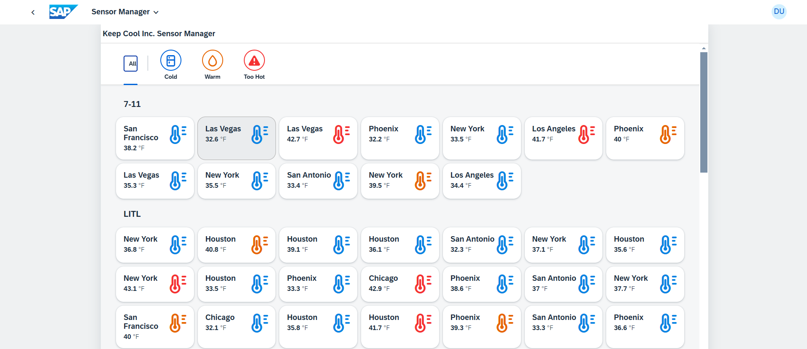
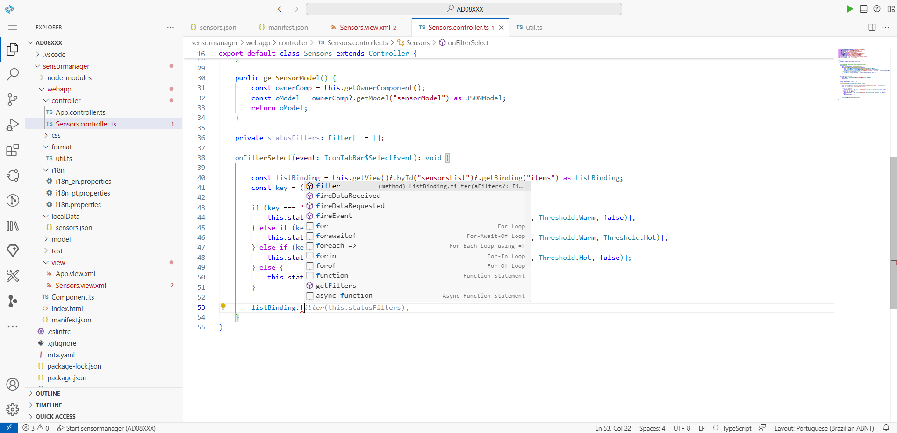
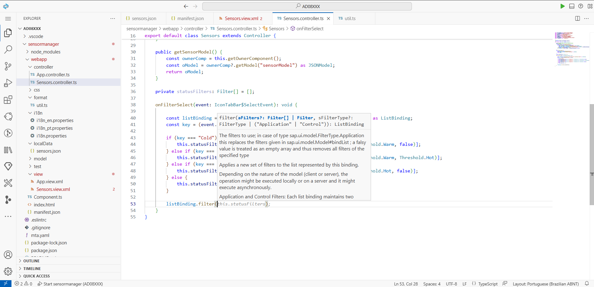
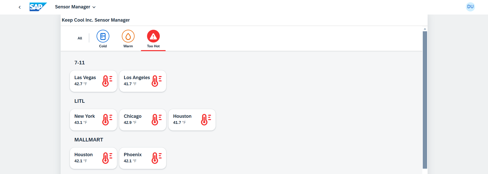

[](https://github.com/SAP-samples/teched2023-AD265/tree/code/exercises/ex6)
[](https://sap-samples.github.io/teched2023-AD283v/ex6/test/flpSandbox-cdn.html?sap-ui-xx-viewCache=false#keepcoolsensormanager-display)

# Exercício 6 - Filtrando com o IconTabBar

Como seu cliente precisa da melhor visão geral para tomar decisões rapidamente, você dará a ele uma opção para restringir a lista de sensores com base na temperatura atual do sensor.

## Exercício 6.1 - Adicione novos IconTabFilters ao Sensors.view.xml

Para isso, você aprimora seu controle `sap.m.IconTabBar`.

1. Abra `sensormanager/webapp/view/Sensors.view.xml`.

2. Insira a agregação `<items>` com elementos `sap.m.IconTabFilter` no início do controle `sap.m.IconTabBar`, antes do `<content>` (na verdade, a posição não importa, mas `<items>` deve ser um irmão no mesmo nível que `<content>`). Os elementos `IconTabFilter` ficarão visíveis como ícones acima da barra, para que o usuário possa clicar neles para filtrar a lista.
###### sensormanager/webapp/view/Sensors.view.xml

```xml
            <IconTabBar id="iconTabBar" class="sapUiResponsiveContentPadding">
                <items>
                    <IconTabFilter showAll="true" text="{i18n>msgFilterAll}" key="All"/>
                    <IconTabSeparator/>
                    <IconTabFilter icon="sap-icon://fridge" iconColor="Default" text="{i18n>msgFilterCold}" key="Cold"/>
                    <IconTabFilter icon="sap-icon://blur" iconColor="Critical" text="{i18n>msgFilterWarm}" key="Warm"/>
                    <IconTabFilter icon="sap-icon://warning" iconColor="Negative" text="{i18n>msgFilterHot}" key="Hot"/>
                </items>
                <content>
                ...
```

3. Vamos ver se seu aplicativo UI5 agora exibe os elementos `sap.m.IconTabFilter` recém-introduzidos! Mude para a aba do navegador com a pré-visualização do aplicativo aberta (recarregue/reinicie se necessário).



## Exercício 6.2 - Implementar a filtragem

Na seção anterior, você adicionou todos os controles de IU necessários. Em seguida, você implementará a lógica de filtragem.

1. Abra `sensormanager/webapp/controller/Sensors.controller.ts`.

2. Implemente a função `onFilterSelect` para filtrar os itens da lista de sensores verificando sua propriedade `status`. Você também fará uso do limite definido anteriormente e usará algumas configurações de filtro para restringir o resultado. `LT`, por exemplo, significa "menor que". Insira o seguinte no corpo da classe, após o final do método `getSensorModel`.

###### sensormanager/webapp/controller/Sensors.controller.ts

```js
    private statusFilters: Filter[] = [];

    onFilterSelect(event: IconTabBar$SelectEvent): void {

        const listBinding = this.getView()?.byId("sensorsList")?.getBinding("items") as ListBinding;
        const key = (event.getParameter("key") as string);

        if (key === "Cold") {
            this.statusFilters = [new Filter("temperature", FilterOperator.LT, Threshold.Warm, false)];
        } else if (key === "Warm") {
            this.statusFilters = [new Filter("temperature", FilterOperator.BT, Threshold.Warm, Threshold.Hot)];
        } else if (key === "Hot") {
            this.statusFilters = [new Filter("temperature", FilterOperator.GT, Threshold.Hot, false)];
        } else {
            this.statusFilters = [];
        }

        listBinding.filter(this.statusFilters);
    }
```

> #### 🧑‍🎓 Explicação
> Você pode novamente fazer uso da funcionalidade *Quick Fix...* ao passar o mouse para adicionar as importações ausentes. Observe que para `Filter` há três módulos disponíveis que serão recomendados ao acionar o > Quick Fix em `Filter`:
> - `sap/ui/model/Filter`
> - `sap/ui/model/odata/Filter`
> - `sap/ui/export/util/Filter`
>
>Ao acionar o Quick Fix em outros módulos ausentes e selecionar "Add all missing imports", um deles será adicionado. Em qualquer caso, certifique-se de que o módulo `sap/ui/model/Filter` seja importado, pois este aplicativo não está usando um modelo OData.

> #### 💡 Dica
> Tente digitar a última linha deste bloco de código manualmente: `listBinding.filter(this.statusFilters);`
>
> Fazendo isso, outra vantagem do TypeScript pode ser vista aqui, pois há digitação antecipada disponível, não apenas para nomes de variáveis ​​como `listBinding`, mas também para métodos disponíveis no tipo de variável fornecido:
>

>
> Também há acesso direto à documentação enquanto você digita, por exemplo, para os parâmetros do método:
>


## Exercício 6.3 - Atribuir a filtragem ao IconTabBar

Em seguida, você precisa atribuir a função de filtragem ao evento `select` do `sap.m.IconTabBar`.

1. Abra `sensormanager/webapp/view/Sensors.view.xml`.

2. Vincule a função `onFilterSelect` ao evento `select` do `IconTabBar`. Sempre que um dos elementos `sap.m.IconTabFilter` for clicado, esta função será chamada.
   
###### sensormanager/webapp/view/Sensors.view.xml

```xml
            <IconTabBar id="iconTabBar" select=".onFilterSelect" class="sapUiResponsiveContentPadding">
```

3. Vamos ver se seu aplicativo UI5 agora consegue filtrar os dados do sensor corretamente. Mude para a aba do navegador com a pré-visualização do aplicativo aberta e recarregue a página. Clique no ícone *Too Hot*. Somente sensores com temperatura muito alta são exibidos.



## Resumo

Muito bem! Você aprimorou com sucesso seu aplicativo de gerenciamento de sensores adicionando um IconTabBar para filtrar dados de sensores com base na temperatura. Este novo recurso permitirá uma tomada de decisão rápida e eficiente para seus usuários.

Da perspectiva do tutorial, você aprendeu como os dados exibidos podem ser filtrados, como essa filtragem pode ser acionada pelo usuário e como o TypeScript ajuda na codificação com assistência de código/preenchimento automático e mostra a respectiva documentação no local.

Continue com o bom trabalho e continue para [Exercício 7 - Fragmento contendo um diálogo](../ex7/README.md)!

## Mais informações

* Filtro de modelo na UI5: https://ui5.sap.com/#/topic/5295470d7eee46c1898ee46c1b9ad763
