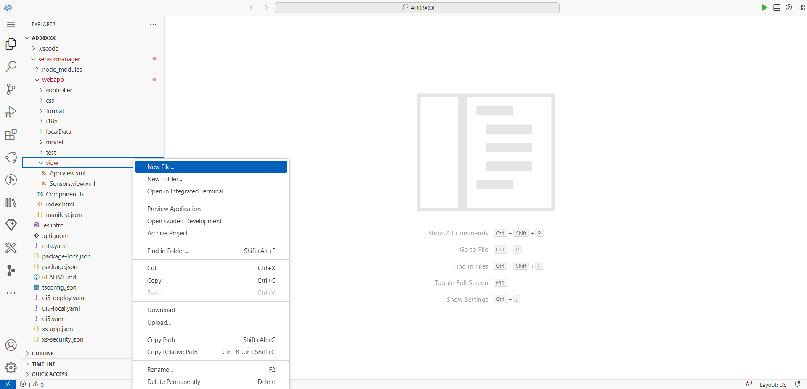
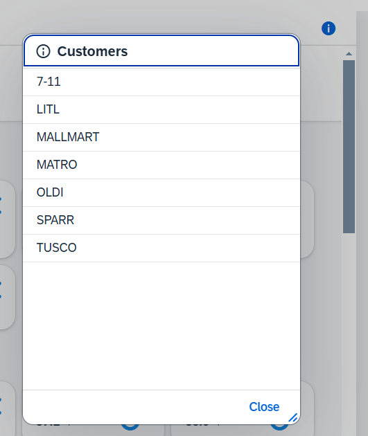
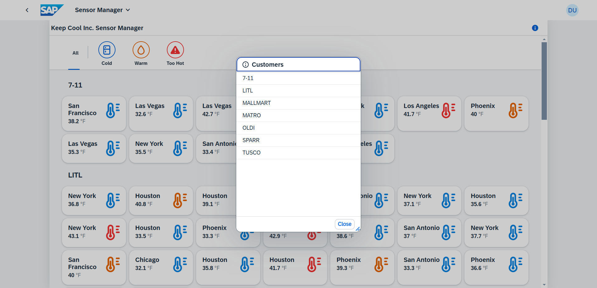

# Exercício 7 - Utilizando Fragmentos e Diálogos

Para uma rápida visão geral de todos os clientes atuais, vamos oferecer um diálogo. Para manter a separação de preocupações, vamos encapsular o conteúdo deste diálogo dentro de um Fragmento. Isso permite potencial reutilização em outro lugar.

## Exercício 7.1 - Gerar uma nova definição de fragmento

Um diálogo apresenta um cenário ideal para utilizar um `sap.ui.core.Fragment`. Este artefato UI5 auxilia na modularização do seu código em componentes menores e reutilizáveis.

1. Navegue até a pasta `sensormanager/webapp/view/`.

2. Clique com o botão direito do mouse na pasta `view` e escolha `New File...`.



3. Especifique `CustomerDialog.fragment.xml` como o nome do arquivo.


4. Copie e cole o seguinte conteúdo no `CustomerDialog.fragment.xml`. Isso definirá um `sap.m.Dialog`, fornecendo funcionalidade para auxiliar os usuários a visualizar seus clientes icehouse atribuídos.

###### sensormanager/webapp/view/CustomerDialog.fragment.xml

```xml
<core:FragmentDefinition
    xmlns="sap.m"
    xmlns:core="sap.ui.core">
    <Dialog
        title="{i18n>titleCustomerDialog}"
        icon="sap-icon://message-information"
        contentHeight="50%"
        resizable="true"
        draggable="true">
        <content>
            <List
                items="{
                    path: 'sensorModel>/customers',
                    sorter: {path:'name'}
                }">
                <StandardListItem title="{sensorModel>name}"/>
            </List>
        </content>
        <buttons>
            <Button text="Close" press=".onCustomerInfoClose"/>
        </buttons>
    </Dialog>
</core:FragmentDefinition>
```

## Exercício 7.2 - Implementar lógica de abertura de diálogo

Após definir o diálogo, você precisa implementar o código que acionará sua abertura.

1. Abra `sensormanager/webapp/controller/Sensors.controller.ts`.

2. Dentro do corpo da classe, implemente a função `onCustomerInfoPress` para abrir o diálogo. Você já sabe como aplicar o *Quick Fix* para adicionar quaisquer importações ausentes. Certifique-se de que o Dialog seja importado de `"sap/m/Dialog"` (há mais Dialogs na UI5)!

###### sensormanager/webapp/controller/Sensors.controller.ts

```js
    private dialog: Promise<Dialog>;

    onCustomerInfoPress(): void {
        this.dialog ??= this.loadFragment({
            name: "keepcool.sensormanager.view.CustomerDialog"
        }) as Promise<Dialog>;

        this.dialog.then((dialog) => dialog.open())
            .catch((err: Error) => MessageToast.show(err.message));
    }
```

> 🧑‍🎓 O exemplo acima demonstra uma forma de instanciação preguiçosa e condicional. O conteúdo do fragmento é carregado somente quando o diálogo ainda não existe. O operador `??=` verifica se a variável `dialog` tem um valor verdadeiro. Se sim, a declaração após o operador `??=` não é executada. Se o `dialog` tiver um valor falso, a ação após o `??=` é executada e o valor resultante é atribuído ao `dialog`.
>
> Como o fragmento possivelmente precisa ser carregado do servidor (de forma assíncrona), esse valor resultante não é diretamente o próprio Dialog, mas uma [*Promise*](https://developer.mozilla.org/en-US/docs/Web/JavaScript/Reference/Global_Objects/Promise), uma construção JavaScript que ajuda a lidar com código assíncrono. Essa Promise *resolve* com o Dialog definido no Fragment.
>
> O método `loadFragment` disponível na instância do controlador atribui o conteúdo do fragmento como um "dependente" para a visualização, então todos os modelos vinculados disponíveis na visualização também estão disponíveis para o conteúdo do fragmento. Além disso, a UI5 toma cuidado para limpar o conteúdo do fragmento quando a visualização é destruída.
> 
## Exercício 7.3 - Insira o botão de abertura de diálogo

Após implementar a lógica de abertura de diálogo, você precisa vincular essa lógica a um controle.

1. Abra `sensormanager/webapp/view/Sensors.view.xml`.

2. Adicione um novo botão ao cabeçalho da página e vincule seu evento `press` à função `onCustomerInfoPress` que foi criada. Você pode fazer isso inserindo a agregação `<headerContent>` antes (ou depois) do `<content>` do controle `Page`.
   
###### sensormanager/webapp/view/Sensors.view.xml

```xml
    <Page id="page" title="{i18n>title}">
        <headerContent>
            <Button icon="sap-icon://information" press=".onCustomerInfoPress" tooltip="{i18n>toolTipShowCustomers}"/>
        </headerContent>
        <content>
        ...
```

3. Mude para a aba de visualização do aplicativo no seu navegador e atualize a página para observar as alterações na interface do usuário do seu aplicativo. Clique no botão "info" no canto superior direito da página para abrir o diálogo. Você não pode fechar o diálogo ainda.



## Exercício 7.4 - Implementação de logica para fechamento da caixa de diálogo

1. Abra `sensormanager/webapp/controller/Sensors.controller.ts`.

2. Dentro do corpo da classe, implemente a função `onCustomerInfoClose` para fechar o diálogo.
   
###### sensormanager/webapp/controller/Sensors.controller.ts

```js
    onCustomerInfoClose(): void {
        this.dialog.then(function(dialog){
            dialog.close();
        }).catch(function(err: Error){
            MessageToast.show(err.message);
        });
    }
```

> 🧑‍🎓 Na variável `this.dialog` não é armazenado o Dialog em si, mas a Promise que resolve com o Dialog. Portanto, chamar `.then(...)` nele fornece o Dialog. Como esse método normalmente só é acionado de dentro do Dialog, que só pode ser exibido quando o fragmento do Dialog é carregado com sucesso, a cláusula `catch(...)` provavelmente nunca é executada (ela seria acionada quando o Promise que carrega o fragmento falha) - mas é melhor prevenir do que remediar, essas pré-condições no código ao redor podem mudar.

3. Mude para a guia de visualização do aplicativo no seu navegador para observar as alterações na interface do usuário do seu aplicativo. Clique no botão de informações no canto superior direito para abrir o diálogo e, em seguida, teste a funcionalidade de fechamento.



## Resumo
Você fez um trabalho fantástico! Neste exercício, você criou com sucesso um fragmento reutilizável que encapsula um diálogo para exibir informações do cliente em seu aplicativo. Você também implementou a lógica para abrir e fechar o diálogo e conectou-o a um botão na interface do usuário. Você está fazendo grandes avanços na modularização do seu código e melhorando a experiência do usuário.

Continue o bom trabalho no [Exercício 8 - Segunda visualização com navegação](../ex8/README.md)!

## Mais informações
* Uso de fragmentos na UI5: https://ui5.sap.com/#/topic/36a5b130076e4b4aac2c27eebf324909
* `sap.m.Dialog`: https://ui5.sap.com/#/api/sap.m.Dialog
