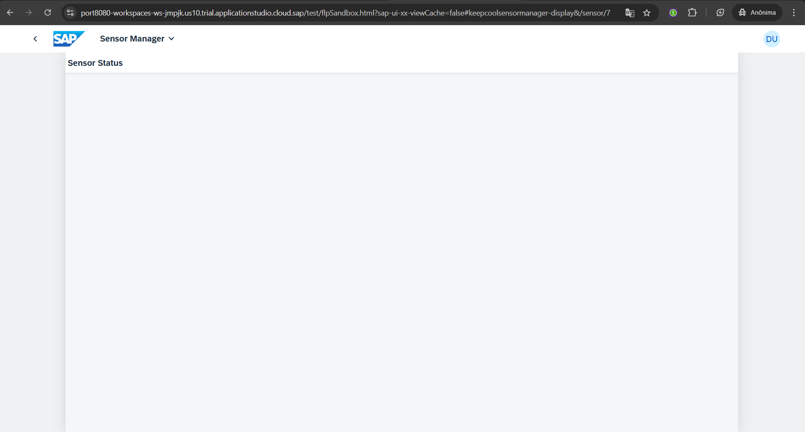
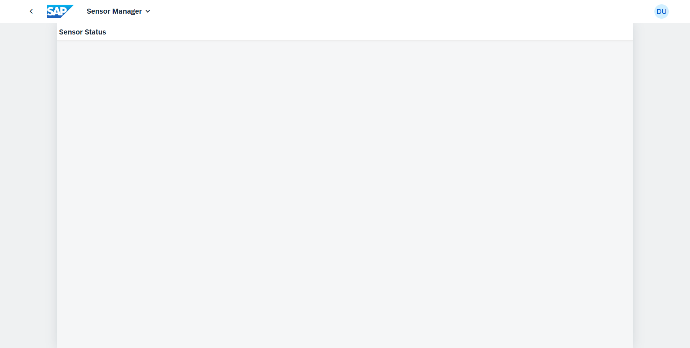
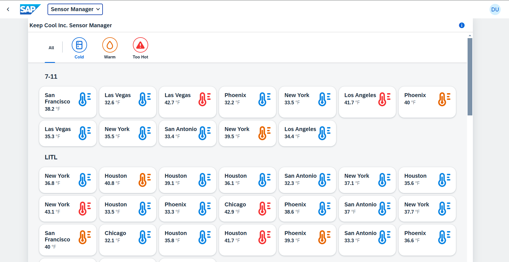
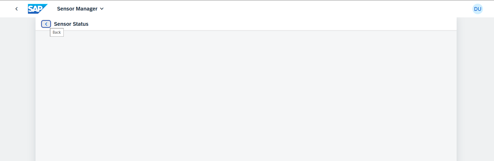
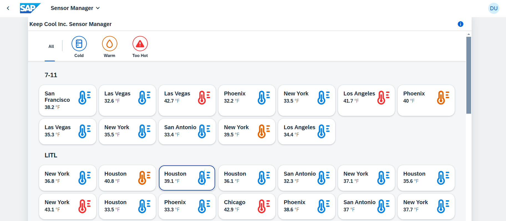

[](https://github.com/SAP-samples/teched2023-AD265/tree/code/exercises/ex8)
[](https://sap-samples.github.io/teched2023-AD283v/ex8/test/flpSandbox-cdn.html?sap-ui-xx-viewCache=false#keepcoolsensormanager-display)

# Exercício 8 - Adicione uma segunda view com navegação

Seu cliente não quer apenas ter uma visão geral de todos os seus depósitos de gelo. Em caso de problemas, ele gostaria de inspecionar um sensor específico para dados de temperatura recentes. Você adicionará uma segunda visualização para exibir dados históricos.

## Exercício 8.1 - Crie SensorStatus.view.xml

Crie uma nova view da seguinte forma:

1. Vá para a pasta `sensormanager/webapp/view/`.

2. Clique com o botão direito do mouse na pasta `view` e selecione `New File`.

3. Insira `SensorStatus.view.xml` como nome do arquivo.

4. Adicione um `sap.m.Page` vazio à visualização recém-criada.

###### sensormanager/webapp/view/SensorStatus.view.xml

```xml
<mvc:View
    displayBlock="true"
    xmlns:mvc="sap.ui.core.mvc"
    xmlns="sap.m">
    <Page
        id="SensorStatusPage"
        title="{i18n>titleSensorStatus}"
        navButtonPress=".navToSensors">
    </Page>
</mvc:View>
```

## Exercício 8.2 - Configurar Routing no arquivo `manifest.json`

Após criar a nova view, você adicionará informações de Routing para ela no arquivo `manifest.json`. O Routing cuida da exibição da visualização UI5 desejada com base no hash de URL do navegador fornecido. Isso torna o roteamento o meio padrão para navegar entre diferentes views/páginas.

1. Abra `sensormanager/webapp/manifest.json`.

2. Vá para a seção `sap.ui5` / `routing` / `routes`.

3. Adicione uma segunda rota chamada "RouteSensorStatus" à configuração `routes`. Como resultado, `routes` deve ficar assim:

###### sensormanager/webapp/manifest.json

```json
                "routes": [
                    {
                        "name": "RouteSensors",
                        "pattern": ":?query:",
                        "target": [
                            "TargetSensors"
                        ]
                    }, {
                        "name": "RouteSensorStatus",
                        "pattern": "sensor/{index}",
                        "target": ["TargetSensorStatus"]
                    }
                ],
```

>🧑‍🎓 Uma rota é uma maneira de abordar uma parte ou estado específico de um aplicativo com um padrão de hash de URL específico. A rota padrão com padrão vazio (ou consulta opcional como neste caso) é o que é exibido por padrão, a nova rota tem o padrão `sensor/{index}`, então um hash de URL começando com "sensor/" acionará a navegação para o destino desta nova rota (o destino será definido abaixo). O segmento de caminho `{index}` entre chaves é variável e usado para transportar um valor para o destino, neste caso *qual* sensor deve ser exibido em detalhes.

4. Vá uma seção abaixo para `sap.ui5` / `routing` / `targets`.

5. Adicione uma nova entrada à configuração `targets`. Este é o destino da rota recém-adicionada e define `SensorStatus` como o nome da exibição a ser exibida. Ele também define o *viewLevel*, que ajuda o roteamento a entender a direção da navegação e exibir a animação de transição correta. Adicione o *viewLevel* correspondente ao `TargetSensors`. No total, a seção `targets` agora precisa ficar assim:

###### sensormanager/webapp/manifest.json

```json
            "targets": {
                "TargetSensors": {
                    "viewType": "XML",
                    "transition": "slide",
                    "clearControlAggregation": false,
                    "viewId": "Sensors",
                    "viewName": "Sensors",
                    "viewLevel": 1
                },
                "TargetSensorStatus": {
                    "viewId": "sensorStatus",
                    "viewName": "SensorStatus",
                    "viewLevel": 2
                }
            }
```

> 🧑‍🎓 Um target define uma viewo que é exibida, ele pode ser referenciado por uma ou mais rotas. Sempre que um alvo é exibido, a view correspondente é carregada e mostrada no aplicativo. Os dois target apontam para as duas views de conteúdo que agora estão presentes no aplicativo.
>
> A terceira view, `App.view.xml` é a view raiz. O mecanismo de roteamento(routing) controla o conteúdo do controle `App` dentro dela - qual das views deve ser exibida dentro do `App`. Essa configuração acontece no bloco `"config"` um pouco mais acima no início da seção `"routing"`: esta parte contém a configuração global do roteador e os valores padrão que se aplicam a todas as routes e targets. Ela define a classe do roteador que você deseja usar e onde as views estão localizadas no aplicativo.
> Em particular, as duas linhas a seguir definem *qual* controle de IU deve ser gerenciado pelo roteador (o `App` com o ID "app") e qual de suas agregações deve ser usada para exibir automaticamente as views ("páginas"):
>
>                "controlAggregation": "pages",
>                "controlId": "app",

6. Vamos ver se a view recém-criada pode ser aberta. Mude para a aba do navegador com a view principal do aplicativo. Adicione `&/sensor/7` no final da URL na barra de endereços do navegador e a página recém-criada será exibida.

> 🧑‍🎓 A URL de view já contém um hash de URL (`#keepcoolsensormanager-display`), então essa parte do hash de roteamento é anexada com um e comercial (`&`).




## Exercício 8.3 - Implementar a navegação para a nova view

Tudo bem. Você pode acessar a view recém-criada. Em seguida, você precisa implementar a lógica para navegar da sua primeira view para a recém-criada.

1. Abra `sensormanager/webapp/controller/Sensors.controller.ts`.

2. Crie a função `navToSensorStatus`. Aqui, você obtém o índice do sensor selecionado no momento e navega para a nova view passando o índice. Novamente, adicione todas as importações ausentes usando o Quick Fix.
   
###### sensormanager/webapp/controller/Sensors.controller.ts

```js
    navToSensorStatus(event: ListItemBase$PressEvent) {
        const sensorIndex = event.getSource().getBindingContext("sensorModel")?.getProperty("index");
        (this.getOwnerComponent() as UIComponent).getRouter().navTo("RouteSensorStatus", {index: sensorIndex});
    }
```

> 🧑‍🎓 "RouteSensorStatus" é o nome da rota que você acabou de adicionar em `manifest.json`. Esta chamada aciona a rota e a UI5 exibe a view pertencente ao destino da rota. `index` era a parte variável do hash da URL e recebe um valor - o número do sensor clicado - aqui. Ao executar o aplicativo, você verá o número real no final da URL.

## Exercício 8.4 - Atribuir a lógica de navegação aos itens do sensor

Após implementar a lógica de navegação, você precisará atribuí-la a um controle, para que ela possa ser acionada pelo usuário.

1. Abra `sensormanager/webapp/view/Sensors.view.xml`.

2. Adicione o evento `press` ao controle `GridListItem` e atribua a função recém-criada.
   
###### sensormanager/webapp/view/Sensors.view.xml

```xml
                            <f:GridListItem type="Active" press=".navToSensorStatus">
```

3. Vamos ver se a lógica de navegação funciona. Mude para a aba do navegador com a pré-visualização do aplicativo aberta. Remova a parte "&/sensor/7" que você acabou de adicionar para teste e pressione *Enter* para ir para a página de visão geral principal novamente. Ou simplesmente reinicie a página de pré-visualização do BAS. Então clique em qualquer sensor. A navegação acontece, e você vê a view vazia recém-criada.



## Exercício 8.5 - Crie SensorStatus.controller.ts e implemente a navegação de volta
Legal. Agora vamos implementar a navegação de volta para `Sensors.view.xml`. Para fazer isso, você precisará de um novo controlador para a view recém-criada.

1. Na pasta `sensormanager/webapp/controller/`, clique com o botão direito do mouse na pasta `controller` e selecione `New File`.

2. Insira `SensorStatus.controller.ts` como nome do arquivo.

3. Copie e cole a definição do controlador fornecida abaixo no `SensorStatus.controller.ts`. O método `navToSensors` usa o método `navTo` do roteador para acionar a rota `RouteSensors`, apontando para a visualização `Sensors.view.xml` inicial.

###### sensormanager/webapp/controller/SensorStatus.controller.ts

```js
import Controller from "sap/ui/core/mvc/Controller";
import UIComponent from "sap/ui/core/UIComponent";

/**
 * @namespace keepcool.sensormanager.controller
 */
export default class SensorStatus extends Controller {

    public onInit() {

    }

    navToSensors() {
        (this.getOwnerComponent() as UIComponent).getRouter().navTo("RouteSensors");
    }

}

```


## Exercício 8.6 - Acione a navegação de volta da view SensorStatus

1. Abra `sensormanager/webapp/view/SensorStatus.view.xml`.

2. Adicione o atributo `controllerName` em `sensormanager/webapp/view/Sensors.view.xml` para atribuir o novo controlador à view. Além disso, adicione o atributo `navButtonPress` ao controle `sap.m.Page` e atribua a função `navToSensors` recém-criada como manipulador para este evento.
   
###### sensormanager/webapp/view/SensorStatus.view.xml

```xml
<mvc:View
    controllerName="keepcool.sensormanager.controller.SensorStatus"
    displayBlock="true"
    xmlns:mvc="sap.ui.core.mvc"
    xmlns="sap.m">
    <Page
        id="SensorStatusPage"
        title="{i18n>titleSensorStatus}"
        showNavButton="true"
        navButtonPress=".navToSensors">
    </Page>
</mvc:View>
```

3. Vamos ver se a lógica de navegação funciona. Mude para a aba do navegador com a pré-visualização do aplicativo aberta. Na URL, remova qualquer hash de URL adicionado anteriormente e recarregue a página.



4. Clique em qualquer sensor. A navegação acontece, e você vê a visualização recém-criada.



5. Clique no botão "<" para navegar de volta para a lista de sensores. Graças ao funcionamento do Router, você também pode usar o botão "Voltar" do navegador ou do seu dispositivo móvel.



## Resumo

Ótimo trabalho ao concluir o Exercício 8! Você adicionou com sucesso uma segunda view ao seu aplicativo e implementou a navegação entre views usando a funcionalidade de roteamento do SAPUI5. Você fez um progresso significativo na melhoria da utilidade e da experiência do usuário do seu aplicativo. Continue com o bom trabalho e continue para [Exercício 9 - Cartão com NumericHeader](../ex9/README.md).

## Mais informações

* Routing UI5: https://ui5.sap.com/#/topic/902313063d6f45aeaa3388cc4c13c34e
