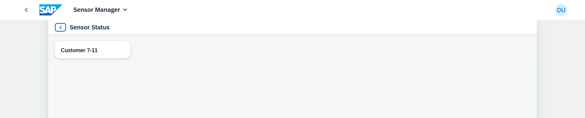
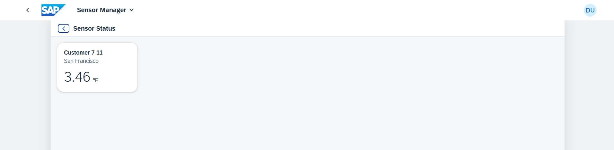
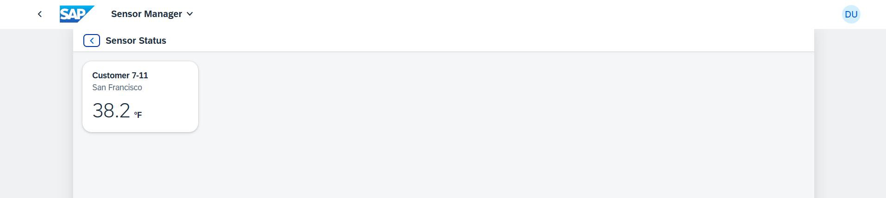
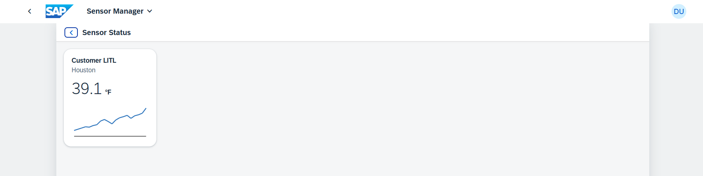
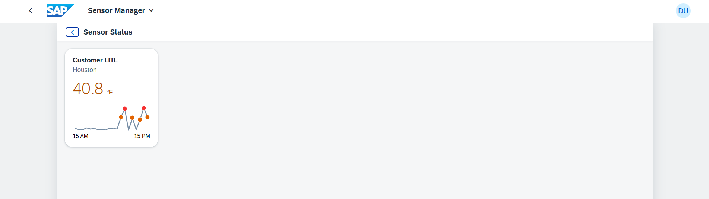

[](https://github.com/SAP-samples/teched2023-AD265/tree/code/exercises/ex9)
[](https://sap-samples.github.io/teched2023-AD283v/ex9/test/flpSandbox-cdn.html?sap-ui-xx-viewCache=false#keepcoolsensormanager-display)

# Exercício 9 - Aprimorando detalhes do sensor com um cartão

Neste exercício, você aumentará a página de status do sensor com um `sap.f.Card` para apresentar dados adicionais sobre o status do sensor. Você também implementará algum layout com controles de caixa e incorporará um `sap.f.cards.NumericHeader` para representar com precisão a temperatura.

## Exercício 9.1 - Incorporando um cartão em SensorStatus.view.xml

Vamos começar aprimorando a visualização `SensorStatus.view.xml`.

1. Abra `sensormanager/webapp/view/SensorStatus.view.xml`.

2. Adicione as bibliotecas `sap.f` e `sap.f.cards` a `SensorStatus.view.xml`.

###### sensormanager/webapp/view/SensorStatus.view.xml

```xml
<mvc:View
    controllerName="keepcool.sensormanager.controller.SensorStatus"
    displayBlock="true"
    xmlns:mvc="sap.ui.core.mvc"
    xmlns="sap.m"
    xmlns:f="sap.f"
    xmlns:card="sap.f.cards">
```

3. Incorpore um `sap.f.Card` com um cabeçalho de cartão em `SensorStatus.view.xml`. Adicione o nome do cliente como o título do cabeçalho por meio de vinculação de dados. Para fazer isso, substitua `<Page>...</Page>` pelo seguinte:

###### sensormanager/webapp/view/SensorStatus.view.xml

```xml
    <Page
        id="SensorStatusPage"
        title="{i18n>titleSensorStatus}"
        showNavButton="true"
        navButtonPress=".navToSensors">
        <content>
            <f:Card width="200px" class="sapUiSmallMargin">
                <f:header>
                    <card:Header title="{parts: ['i18n>cardTitle', 'sensorModel>customer']}"/>
                </f:header>
                <f:content>

                </f:content>
            </f:Card>
        </content>
    </Page>
```

## Exercício 9.2 - Defina o contexto de dados em SensorStatus.controller.ts

Para exibir os dados do sensor escolhido em seu cartão, você precisa acessar os dados fornecidos pelo roteador para a etapa de navegação e atribuir o contexto de vinculação correto à view. Dessa forma, a vinculação de dados padrão funcionará com os dados relacionados ao sensor escolhido.

1. Abra `sensormanager/webapp/controller/SensorStatus.controller.ts`.

2. Anexe uma função de retorno de chamada ao evento `routeMatched` para buscar o índice do sensor passado e utilizá-lo no caminho de vinculação de dados para a view. Você também precisa definir uma interface TypeScript para o objeto de parâmetro, para que o tipo de índice seja claramente definido como `number`. Como resultado, o arquivo deve ficar assim:

###### sensormanager/webapp/controller/SensorStatus.controller.ts

```js
import Controller from "sap/ui/core/mvc/Controller";
import UIComponent from "sap/ui/core/UIComponent";
import { Route$MatchedEvent } from "sap/ui/core/routing/Route";

interface RouteMatchedParameters {
    index: number
}

/**
 * @namespace keepcool.sensormanager.controller
 */
export default class SensorStatus extends Controller {
    public onInit() {
        (this.getOwnerComponent() as UIComponent).getRouter().getRoute("RouteSensorStatus")?.attachMatched(this.onRouteMatched, this);
    }

    public onRouteMatched(event: Route$MatchedEvent) {
        this.getView()?.bindElement({
            path: "/sensors/" + (event.getParameter("arguments") as RouteMatchedParameters).index,
            model: "sensorModel"
        });
    }

    public navToSensors() {
        (this.getOwnerComponent() as UIComponent).getRouter().navTo("RouteSensors");
    }

}
```

> #### 🧑‍🎓 Explicação
> Dentro de `onRouteMatched`, a primeira linha define o contexto de vinculação de dados para os valores preenchidos abaixo: o *modelo* é o WsensorModel" que contém os dados do sensor e o *path* dentro do modelo do qual os dados são usados ​​é "/sensors/" mais o índice do sensor clicado, que é recuperado do evento de roteamento. O path resultante (como, por exemplo, `/sensors/8`) se refere aos dados de um sensor específico na estrutura de dados JSON.
>
> Quando propriedades de dados como "temperatura" são usadas na vinculação de dados desta view, elas se referem automaticamente à temperatura do sensor com o índice atual 8.

3. Mude para a guia do navegador onde a view do aplicativo é aberta. Clique em qualquer sensor. Agora, a página de status do sensor contém um cartão com o nome do cliente.



## Exercício 9.3 - Adicione um NumericHeader ao Card

Para melhorar ainda mais a visualização, você trocará o `sap.f.cards.Header` pelo `sap.f.cards.NumericHeader` no seu card recém-criado.

1. Abra `sensormanager/webapp/view/SensorStatus.view.xml` e troque o conteúdo `<f:header>` existente pelo seguinte:

###### sensormanager/webapp/view/SensorStatus.view.xml

```xml
                <f:header>
                    <card:NumericHeader title="{i18n>cardTitle} {sensorModel>customer}"
                        subtitle="{sensorModel>location}" number="{sensorModel>temperature}" scale="{i18n>temperatureUnit}"/>
                </f:header>
```

2. Mude para a aba do navegador onde a pré-visualização do aplicativo está aberta. Clique em qualquer sensor. Agora, a página de status do sensor apresenta um cartão que inclui informações de temperatura (ainda sem conversão em Fahrenheit).



3. Adicione um formatador para aplicar coloração semântica ao cabeçalho do cartão.
O formatador utiliza tanto o limite quanto a temperatura atual do modelo. Com base nesses valores, ele retorna o `sap.m.ValueColor`. Abra `sensormanager/webapp/format/util.ts` e insira a função do formatador fornecida abaixo. Não se esqueça de importar o módulo `sap.m.ValueColor`, que oferece excelente suporte a cores, usando o *Quick Fix*.

###### sensormanager/webapp/format/util.ts

```js
export function formatValueColor(temperature: number): ValueColor {
    if (temperature < Threshold.Warm) {
        return ValueColor.Neutral;
    } else if (temperature >= Threshold.Warm && temperature < Threshold.Hot) {
        return ValueColor.Critical;
    } else {
        return ValueColor.Error;
    }
}
```

4. O controle `sap.f.cards.NumericHeader` apresenta uma propriedade `state`, que permite que você apresente o estado do seu controle de uma maneira visualmente envolvente. Prossiga para abrir `sensormanager/webapp/view/SensorStatus.view.xml`.

5. Primeiro adicione a dependência para recuperar o `util` necessário, incluindo o namespace "core" necessário para o próprio "require".

###### sensormanager/webapp/view/SensorStatus.view.xml

```xml
<mvc:View displayBlock="true"
    controllerName="keepcool.sensormanager.controller.SensorStatus"
    xmlns:mvc="sap.ui.core.mvc"
    xmlns="sap.m"
    xmlns:f="sap.f"
    xmlns:card="sap.f.cards"
    xmlns:core="sap.ui.core"
    core:require="{
        util: 'keepcool/sensormanager/format/util'
    }">
```

6. Adicione a propriedade `state` ao seu cabeçalho numérico e insira informações de vinculação de dados apontando para sua função formatadora recém-criada. Como você tem acesso ao módulo `util`, você também o usa para a formatação de números e conversão Fahrenheit.

###### sensormanager/webapp/view/SensorStatus.view.xml

```xml
                <f:header>
                    <card:NumericHeader title="{i18n>cardTitle} {sensorModel>customer}" subtitle="{sensorModel>location}"
                        number="{parts: ['sensorModel>temperature', 'i18n>temperatureUnit'], formatter:'util.formatTemperature'}"
                        scale="{i18n>temperatureUnit}" state="{path: 'sensorModel>temperature', formatter: 'util.formatValueColor'}" />
                </f:header>
```

7. Mude para a aba do navegador onde a pré-visualização do aplicativo é aberta. Selecione qualquer sensor. A página de status do sensor agora deve exibir um cartão com detalhes de temperatura codificados por cores que variam com base no valor da temperatura.
   


## Exercício 9.4 - Adicionar um gráfico ao cartão

Para mostrar alguns dados históricos, você pode usar o `temperatureLog` dos dados do sensor. Você usará um `sap.suite.ui.microchart.LineMicroChart` para adicionar os pontos de dados.

1. Abra `sensormanager/webapp/view/SensorStatus.view.xml`.

2. Adicione o namespace para a biblioteca `sap.suite.ui.microchart` ao `SensorStatus.view.xml`.

###### SensorStatus/webapp/view/SensorStatus.view.xml

```xml
<mvc:View
    controllerName="keepcool.sensormanager.controller.SensorStatus"
    displayBlock="true"
    xmlns:mvc="sap.ui.core.mvc"
    xmlns="sap.m"
    xmlns:f="sap.f"
    xmlns:card="sap.f.cards"
    xmlns:core="sap.ui.core"
    core:require="{
        util: 'keepcool/sensormanager/format/util'
    }"
    xmlns:mc="sap.suite.ui.microchart">
```

3. Adicione o gráfico à agregação de conteúdo do cartão e vincule o `temperatureLog` à agregação `points`. Para cada ponto, você exibirá a propriedade `temperature`.

###### SensorStatus/webapp/view/SensorStatus.view.xml

```xml
                <f:content>
                    <mc:LineMicroChart
                        id="lineMicroChart"
                        class="sapUiSmallMarginBeginEnd sapUiSmallMarginBottom"
                        size="Auto"
                        points="{sensorModel>temperatureLog}">
                        <mc:LineMicroChartEmphasizedPoint
                            x="{sensorModel>time}"
                            y="{sensorModel>temperature}"/>
                    </mc:LineMicroChart>
                </f:content>
```

> 🧑‍🎓 Nos dados JSON, o `temperatureLog` em cada sensor é uma matriz extensa contendo dados históricos de temperatura e o carimbo de data/hora correspondente. Ao vincular os `points` a essa matriz, cada entrada `temperatureLog` servirá como um ponto no gráfico. Os valores X e Y são mapeados nas configurações `LineMicroChartEmphasizedPoint`.

4. Mude para a guia do navegador onde a view do aplicativo é aberta. Clique em qualquer sensor. Agora, a página de status do sensor contém um gráfico com um histórico de temperatura.



## Exercício 9.5 - Adicionar informações adicionais

1. Abra `sensormanager/webapp/view/SensorStatus.view.xml`.

2. Para melhorar a legibilidade do gráfico, você deve fornecer algumas informações adicionais. Adicione rótulos ao gráfico junto com um indicador para o limite. Como feito em exercícios anteriores, também forneça alguma coloração semântica e mostre apenas os pontos de dados relevantes com a ajuda da vinculação de expressão.

###### SensorStatus/webapp/view/SensorStatus.view.xml

```xml
                <f:content>
                    <mc:LineMicroChart
                        id="lineMicroChart"
                        class="sapUiSmallMarginBeginEnd sapUiSmallMarginBottom"
                        leftBottomLabel="15 AM"
                        rightBottomLabel="15 PM"
                        threshold="{=util.formatTemperature(util.Threshold.Hot, ${i18n>temperatureUnit})}"
                        thresholdDisplayValue="{=util.formatTemperature(util.Threshold.Hot) + '{i18n>temperatureUnit}'}"
                        showThresholdValue="true"
                        size="Auto"
                        points="{sensorModel>temperatureLog}">
                        <mc:LineMicroChartEmphasizedPoint
                            x="{sensorModel>time}"
                            y="{parts: ['sensorModel>temperature', 'i18n>temperatureUnit'], formatter:'util.formatTemperature'}"
                            color="{path: 'sensorModel>temperature', formatter:'util.formatValueColor'}"
                            show="{=${sensorModel>temperature}>util.Threshold.Warm}"/>
                    </mc:LineMicroChart>
                </f:content>
```
3.Mude para a aba do navegador onde a pré-visualização do aplicativo é exibida. Selecione qualquer sensor. A página de status do sensor agora deve exibir um gráfico contendo um histórico de temperatura com pontos de dados coloridos, rótulos adicionais e uma linha de limite.



## Resumo

Parabéns! Você enriqueceu com sucesso sua página de status do sensor com um cartão detalhado mostrando informações do sensor. Este cartão, criado usando `sap.f.Card` e `sap.f.cards.NumericHeader`, exibe dados valiosos do sensor, como temperatura, detalhes do cliente e um gráfico histórico de dados de temperatura. Você também aprendeu a usar micrográficos com recursos adicionais, como pontos enfatizados, linhas de limite e coloração semântica para melhor visualização de dados.

Você fez tudo, esta foi a última etapa do tutorial. Continue com o bom trabalho e continue curioso sobre o SAPUI5, pois ainda há muito a aprender! Encontre mais informações e tutoriais sobre o SAPUI5 abaixo.

## Mais informações
* Cards: https://ui5.sap.com/#/topic/5b46b03f024542ba802d99d67bc1a3f4
* `sap.f.Card`: https://ui5.sap.com/#/api/sap.f.Card
* `sap.f.cards.NumericHeader`: https://ui5.sap.com/#/api/sap.f.cards.NumericHeader
* Métodos e Eventos para Navegação: https://ui5.sap.com/#/topic/516e477e7e0b4e188b19a406e7528c1e
* UI5 Microcharts: https://ui5.sap.com/#/topic/9cbe3f06465e47b8a136956034a718ed
* Formatting, Parsing, and Validating Data: https://ui5.sap.com/#/topic/07e4b920f5734fd78fdaa236f26236d8
* UI5 Tutorials: https://sapui5.hana.ondemand.com/#/topic/8b49fc198bf04b2d9800fc37fecbb218
* SAP Tutorials: https://developers.sap.com/tutorial-navigator.html
